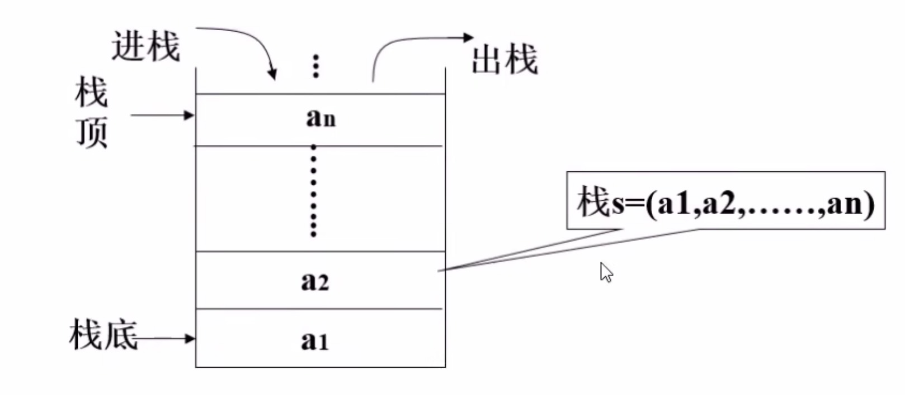

# 栈和队列

## 一、栈

### 1. 定义

栈是限制在一端进行插入操作和删除操作的线性表(俗称堆栈)，

允许进行操作的一端称为”栈顶“，另一固定端称为”栈底“，当栈中没有元素时称为”空栈“。

### 2. 特点

- 栈只能在一端进行操作。

- 栈模型具有先进后出，或者叫后进先出的规律。

### 3. 栈的代码实现

栈的操作有入栈(压栈)，出栈(弹栈),判断栈的空满等操作。

- 顺序存储代码实现sstack.py

- 链式存储代码实现lstack.py

