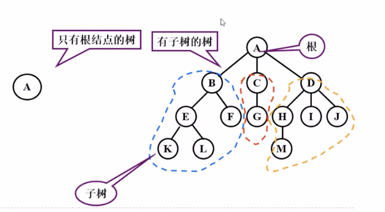
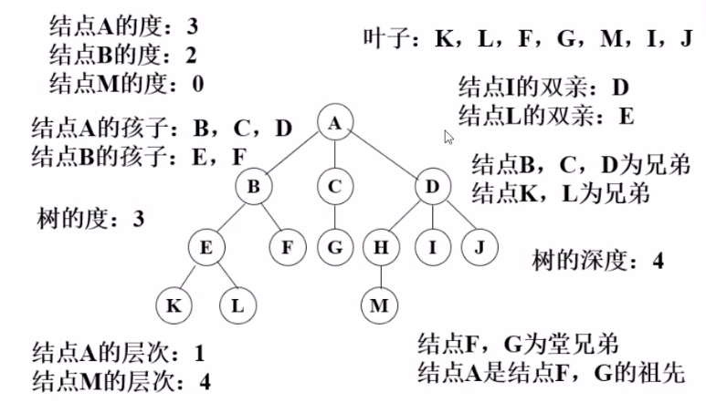
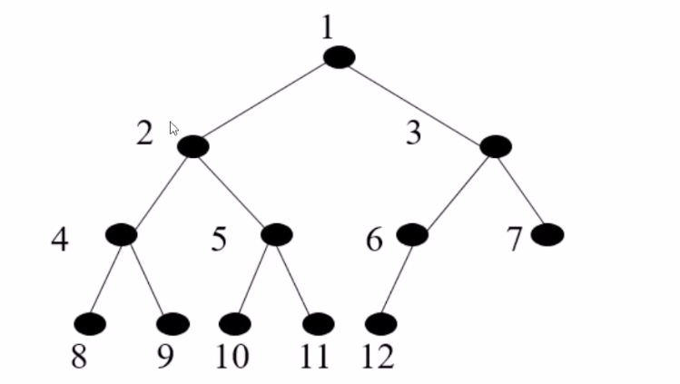

# 树形结构

## 基础概念

### 1. 定义

树（Tree）是n个节点的有限集合T，它满足两个条件：有且仅有一个特定的称为根（Root）节点；其余的节点可以分为m(m>=0)个互不相交的有限集合T1,T2... Tm，其中每一个集合又是一棵树，并称为其根的子树(Subtree)。

### 2. 基本概念

- 一个节点的子树的个数称为该节点的度数，一个树的度数是指该树种节点最大度数。
- 度数为0 的节点称为输液的或终端节点，度数不为0 的节点称为分支节点，除根节点 外的分支节点称为内部节点
- 一个节点的子树之根节点称为该节点的子节点，该节点称为它们的父节点，同一节点的各个子节点之间称为兄弟节点。一颗树的根节点没有父节点，叶子节点没有子节点。
- 一个节点系列k1,k2,k3.....ki,ki+1,.....kj并满足ki是ki+1的父节点，就称为一条从k1到kj的路径，路径的长度为j-1，即路径中的边数。路径中前面的节点是后面节点的祖先，后面节点是前面节点的子孙。
- 节点的层数等于父节点的层数加一，根节点的层数定义为1.树中节点层数的最大值称为该树的高度或深度。
- m(m>=0) 棵互不相交的树的集合称为森林。树去掉根节点就成为森林，森林加上一个新的根节点就成为树。

## 二叉树

### 1.定义

二叉树(Binary Tree)是n(n>=0)个节点的有限集合，它或者是空集(n=0)，或者是由一个根节点以及两棵互不相交的、分别称为左子树和右子树的二叉树组成。二叉树与普通有序树不同，二叉树严格区分左孩子和右孩子，即使只有一个子节点也要区分左右。

### 2. 二叉树特征
- 二叉树的第i(i>=1)层上的节点最多为 2^i-1^ 个。
- 深度为k(k>=1)的二叉树最多有 2^k^-1个节点。

