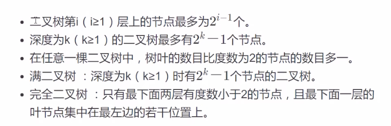
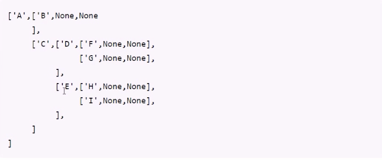
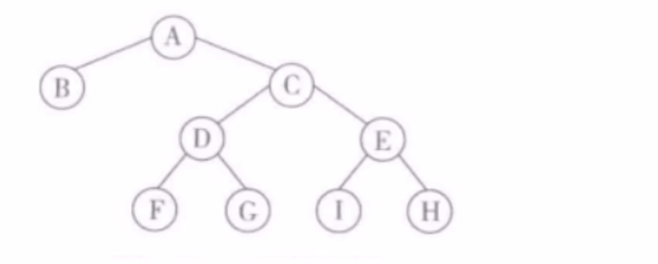

# 树形结构

## 基础概念

### 1. 定义

树（Tree）是n个节点的有限集合T，它满足两个条件：有且仅有一个特定的称为根（Root）节点；其余的节点可以分为m(m>=0)个互不相交的有限集合T1,T2... Tm，其中每一个集合又是一棵树，并称为其根的子树(Subtree)。 

### 2. 基本概念

- 一个节点的子树的个数称为该节点的度数，一个树的度数是指该树中节点最大度数。
- 度数为0 的节点称为树叶的或终端节点，度数不为0 的节点称为分支节点，除根节点 外的分支节点称为内部节点
- 一个节点的子树之根节点称为该节点的子节点，该节点称为它们的父节点，同一节点的各个子节点之间称为兄弟节点。一颗树的根节点没有父节点，叶子节点没有子节点。
- 一个节点系列k1,k2,k3.....ki,ki+1,.....kj并满足ki是ki+1的父节点，就称为一条从k1到kj的路径，路径的长度为j-1，即路径中的边数。路径中前面的节点是后面节点的祖先，后面节点是前面节点的子孙。
- 节点的层数等于父节点的层数加一，根节点的层数定义为1.树中节点层数的最大值称为该树的高度或深度。
- m(m>=0) 棵互不相交的树的集合称为森林。树去掉根节点就成为森林，森林加上一个新的根节点就成为树。

## 二叉树

### 1.定义

二叉树(Binary Tree)是n(n>=0)个节点的有限集合，它或者是空集(n=0)
，或者是由一个根节点以及两棵互不相交的、分别称为左子树和右子树的二叉树组成。二叉树与普通有序树不同，二叉树严格区分左孩子和右孩子，即使只有一个子节点也要区分左右。 

### 2. 二叉树特征

### 二叉树的遍历

遍历： 沿某条搜索路径周游二叉树，对树中的每一个节点访问一次且仅访问一次。

- 先序遍历：先访问树根，在访问左子树，最后访问右子树。
- 中序遍历：先访问左子树，再访问树根，最后访问右子树。
- 后序遍历：先访问左子树，再访问右子树，最后访问树根。
- 层次遍历：从根节点开始，逐层从左向右进行遍历。

## 递归思想和实践

### 1. 什么是递归

所谓递归函数是指一个函数的函数体直接调用或间接调用了该函数自身的函数。这里的直接调用是指一个函数中含有调用自身的语句，间接调用是指一个函数在函数体里有调用了其他函数，而其他函数又反过来调用了该函数的情况。

### 2. 递归函数调用的执行过程分为两个阶段

递推阶段：从原问题出发，按递归公式递推从未知到已知，最终达到递归终止条件。   
回归阶段：按递归终止条件求出结果，逆向逐步代入递归公式，回归到原问题求解。

### 3. 优点和缺点

- 优点：递归可以把问题简单化，让思路更为清晰，代码更简洁。
- 缺点：递归因系统环境影响大，当递归深度太大时，可能会得到不可预知的结果。

## 二叉树的代码实现

### 二叉树顺序存储

二叉树本身是一种递归结构，可以使用python list进行存储。但是如果二叉树的结构比较稀疏的话浪费的空间是比较多的。

- 空节点用None表示。
- 非空二叉树用包含三个元素的列表[d,l,r]表示，其中d表示根节点，l,r表示左子树和右子树。
  

### 二叉树链式存储

二叉树遍历：bitree.py

