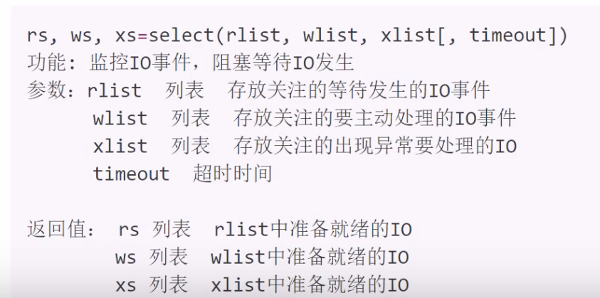

# IO分类

IO分类：阻塞IO，非阻塞IO，IO多路复用，异步IO等。

## 阻塞IO

1. 定义： 在执行IO操作时如果执行条件不满足则阻塞，阻塞IO是IO默认形态
2. 效率：阻塞IO是效率很低的一种IO。但是由于逻辑简单所以是默认IO行为。
3. 阻塞情况：
    - 因为某种执行条件没有满足造成的函数阻塞
        - a.g,accept,input,recv
    - 处理IO的时间较长产生的阻塞状态
        - e.g，网络传输，大文件读写

## 非阻塞IO

1. 定义：通过修改IO属性行为，使原本阻塞的IO变为非阻塞的状态。

- 设置套接字为非阻塞IO

            sockfd.setblocking(bool)
            功能：设置套接字为非阻塞IO
            参数：默认True，表示套接字IO阻塞，设置为False则套接字IO变为非阻塞。  
- 超时检测：设置一个最长阻塞时间，超过该时间后则不再阻塞等待。

            sockfd.settimeout(sec)
            功能：设置套接字的超时时间
            参数：设置的时间

## IO多路复用

1. 定义：同时监控多个IO事件，当哪个事件准备就绪就执行哪个IO事件。以此形成可以同时处理多个IO的行为，避免一个IO阻塞造成其他IO均无法执行，  
提高了IO执行效率。
2. 具体方案：

- select方法：windows linux unix
- poll方法：linux unix
- epoll方法：linux

### select方法

**代码实现 select_server.py**

  

注意：  

            wlist中如果存在IO事件，则select立即返回给ws处理IO
            处理IO过程中不要出现死循环占有服务端情况
            IO多路复用消耗资源较少，效率较高。

            

            