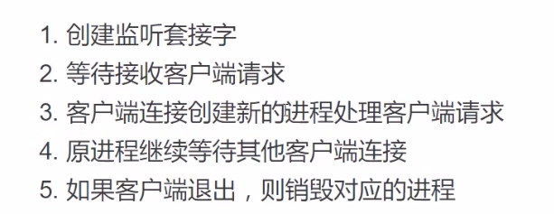

# 常见模型分类
1. 循环服务器模型：循环接收客户端请求，处理请求。同一个时刻只能处理一个请求，处理完毕后再处理下一个。  
            
        优点：实现简单，占用资源少。
        缺点：无法同时处理多个客户端请求
    
        适用情况：处理的任务可以很快完成，客户端无需长时间占用服务端程序。udp比tcp更适合循环

2. IO并发模型：利用IO多路复用，异步IO等技术，同时处理多个客户端IO请求。
        
            优点：资源消耗少，能同时处理多个IO行为。
            缺点：只能处理并发产生的IO事件，无法处理cpu计算。
        
            适用情况：HTTP请求，网络传输等都是IO行为。

3. 多进程/线程网络并发模型：每当一个客户端连接服务器，就创建一个新的进程/线程为该客户端服务，客户端退出时再销毁该进程/线程

            优点：能同时满足多个客户端长期占有服务端需求，可以处理各种请求。
            缺点：资源消耗较大。

            使用情况：客户端同时连接量较少，需要处理行为较复杂情况。

# 基于fork的多进程网络并发模型
代码实现：fork_server.py  
实现步骤：  

