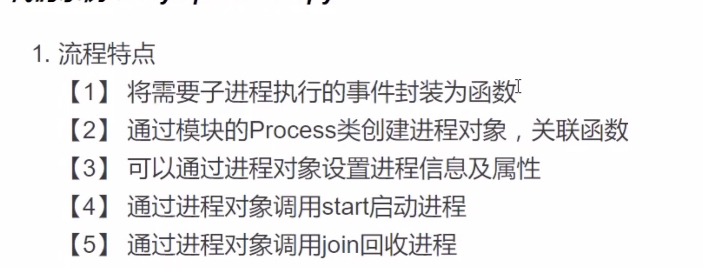
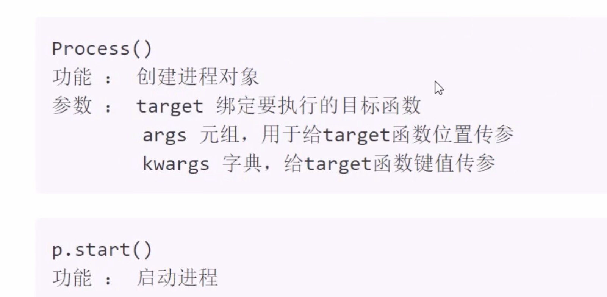
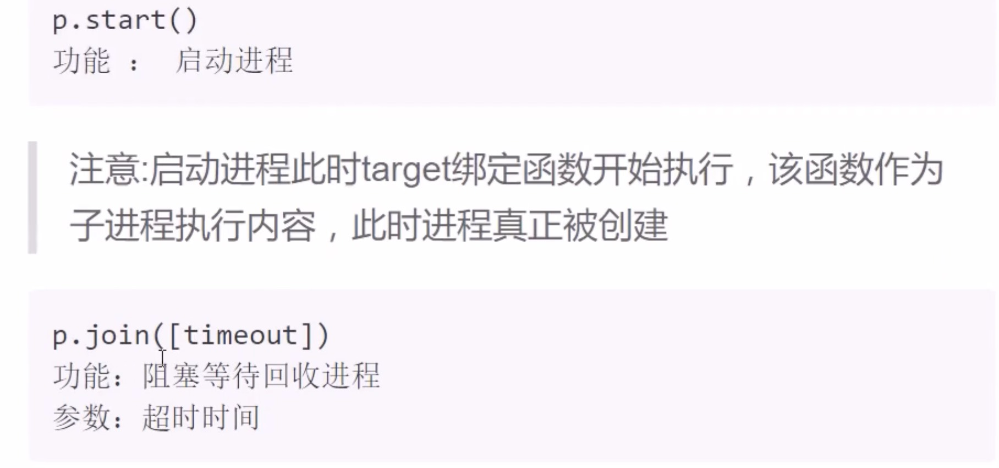

[TOC]

# 多任务编程

1. 意义： 充分利用计算机多核资源，提高程序的运行效率。
2. 实现方案： 多进程、多线程。
3. 并行与并发：

- 并发： 同时处理多个任务，内核在任务间不断地切换达到好像多个任务被同时执行的效果，实际每个时刻只有一个任务占有内核。
- 并行：多个任务利用计算机资源在同时执行，此时多个任务为并行关系。

# 进程

## 进程理论基础

1. 程序在计算机中的一次运行。

- 程序是一个可执行的文件，是静态的占有磁盘。

- 进程是一个动态的过程描述，占有计算机运行资源，有一定的生命周期。

2. 系统如何产生一个进程

- 用户空间通过调用程序接口或者命令发起请求。

- 操作系统接收用户请求，开始创建进程。

- 操作系统调配计算机资源，确定进程状态等。

- 操作系统将创建的进程提供给用户使用。

3. 进程基本概念

- cpu时间片：如果一个进程占有cpu内核，则称这个进程再cpu时间片上。

- PCB（进程控制块）：在内存中开辟的一块空间。用于存放进程的一些基本信息，也用于查找识别进程。

- 进程ID（PID）：系统为每个进程分配一个大于0的整数，作为进程ID。每个进程ID不重复。linux查看进程：ps -aux

- 父子进程：系统中每一个进程（除了系统初始化进程）都有唯一的父进程，可以有0个或多个子进程。父子进程关系便于管理。查看进程树(pstree)

- 进程状态

    - 三态 就绪态：进程具备执行条件，等待分配cpu资源。 运行态：进程占有cpu时间片正在运行。  
      等待态：进程暂时停止运行，让出cpu。

    - 五态(在三态基础上增加新建和终止)

      新建：创建一个进程，获取资源的过程。

      终止：进程结束释放资源。  

- 状态查看命令：ps -aux --->STAT列

       S：等待态
       R：执行态
       D：等待态
       T：等待态
       Z：僵尸

- 进程的运行特征

    - 进程可以使用计算机多核资源。

    - 进程是计算机分配资源的最小单位。

    - 进程之间的运行互不影响，各自独立。

    - 每个进程拥有独立的空间，各自使用自己的空间资源。

- 面试要求

    - 什么是进程，进程和程序有什么区别。

    - 进程有哪些状态，状态之间如何转化。

# 基于fork的多进程编程

## fork使用

pid = os.fork()

功能：创建新的进程

返回值：整数，如果创建进程失败返回一个负数，如果成功则在原有进程中返回新进程的PID，在新进程中返回0

注意:

- 子进程会复制父进程全部内存空间，从fork下一句开始执行。

- 父子进程各自独立运行，运行顺序不一定。

- 利用父子进程fork返回值的区别，配合if结构让父子进程执行不同的内容几乎是固定搭配。

- 父子进程有各自特有特征比如PID PCB 命令集等

- 父进程fork进程之前开辟的空间子进程同样拥有，父子进程对各自空间的操作不会互相影响

## fork相关函数

     os.getpid()
     功能：获取一个进程号的PID值
     返回值：返回当前进程的PID
    
     os.getppid()
     功能：获取父进程的PID号
     返回值：返回父进程PID
    
     os.exit(status)
     功能：结束一个进程
     参数：进程的终止状态
    
     sys.exit([status])
     功能：退出进程
     参数：整数 表示退出状态
     字符串表示退出时打印内容。

# 孤儿和僵尸

孤儿进程：父进程先于子进程退出，此时子进程成为孤儿进程

特点：孤儿进程会被系统进程收养，此时系统进程就会成为孤儿进程新的父进程，孤儿进程退出，该进程会自动处理。

僵尸进程：子进程先于父进程退出，父进程又没有处理子进程的退出状态，此时子进程就会称为僵尸进程。

特点：僵尸进程虽然结束，但是会留存部分PCB在内存中，大量的僵尸进程会浪费系统的内存资源。

如何避免僵尸进程产生：

- 使用wait函数处理子进程退出。

  ```python
  pid,status = os.wait()
  功能：在父进程中阻塞等待处理子进程退出。  
  返回值：pid 退出的子进程的PID
  status 子进程退出状态
  ```

- 创建二级子进程处理僵尸

    - 父进程创建子进程，等待回收子进程

    - 子进程创建二级子进程然后退出

    - 二级子进程称为孤儿，和原来父进程一同执行事件。

- 通过信号处理子进程退出

  原理：子进程退出时会发送信号给父进程，如果父进程忽略子进程信号，则系统就会自动处理子进程退出。

  方法：使用signal模块在父进程创建子进程前写如下语句：

  ```python
  import signal
  signal.signal(signal.SIGCHLD,signal.SIG_IGN)
  ```

特点：非阻塞，不会影响父进程运行。可处理所有子进程退出。

# multiprocessing 模块创建进程

## 流程特点



## 基本接口使用




注意：

- 使用multiprocessing 创建进程同样时子进程复制父进程空间代码段，父子进程运行互不影响。

- 子进程只运行target绑定的函数部分，其余内容均是父进程执行内容。
- multiprocessing中父进程往往只用来创建子进程回收子进程，具体事件由子进程完成。
- multiprocessing创建的子进程中无法使用标准输入。

## 进程的对象属性

      p.name 进程名称
      p.pid 对应子进程PID
      p.is_alive() 是否在生命周期内
      p.daemon=True 设置父进程的退出关系
        如果为True则子进程会随父进程退出而结束
        要求必须在start()前设置
        如果daemon设置成True通常就不会使用join()

## 进程池实现

1. 必要性

- 进程的创建和销毁过程消耗的资源较多
- 当任务量众多，每个任务在很短的时间内完成时，需要频繁的创建和销毁进程。此时对计算机压力较大。
- 进程池技术很好的解决了以上问题。

2. 原理：

创建一定数量的进程来处理事件，事件处理完进程不退出而是继续处理其他事件，直到所有事件全都处理完毕统一销毁。增加进程的重复利用，降低资源消耗。

3. 进程池实现

- 创建进程池对象，放入适当的进程

```python
from multiprocessing import Pool

Pool(processes=5)
# 功能：创建进程池对象
# 参数：指定进程数量，默认根据系统自动判定。
```

- 将事件加入进程池队列执行

```shell
pool.apply_async(func,args,kwds)
#功能：使用进程池执行func事件
#参数：func 事件函数
      args 元组，给func传递参数
      kwds 字典，给func按照键值传参
返回值：返回函数时间对象。
```

- 关闭进程池

```shell
pool.close()
#关闭进程池
```

- 回收进程池中进程

```shell
pool.join()
回收进程池中进程。
```

