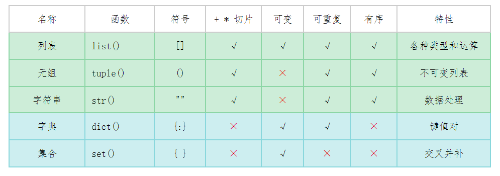

# 一、Python 数据类型

- 数字 Number
- 字符串 String
- 布尔类型 bool
- 列表 List
- 元组 Tuple
- 集合 Set
- 字典 Dictionary

不可变类型：数字、字符串、元组  

可变类型：列表、字典、集合

  


# 二、 类与对象 
## 类与对象
类(Class)是用来描述具有相同属性(Attribute)和方法(Method)对象的集合。
对象(Object)是类(Class)的具体实例。比如每个学生都有名字和分数，这是他们共同的属性。这时我们就可以设计一个学生类, 
用于记录学生的名字和分数，并自定义方法打印出他们的名字和方法。
- 属性(Attribute): 类里面用于描述所有对象共同特征的变量或数据。比如学生的名字和分数。
- 方法(Method): 类里面的函数，用来区别类外面的函数, 用来实现某些功能。比如打印出学生的名字和分数。  

要创建一个类我们需要使用关键词class. 这个学生类Student看上去应该是这样的:
```python
# 创建一个学生类
class Student:
    # 定义学生属性，初始化方法
    def __init__(self, name, score):
        self.name = name
        self.score = score

    # 定义打印学生信息的方法
    def show(self):
        print("Name: {}. Score: {}".format(self.name, self.score))
``` 

## 类变量与实例变量
假设我们需要在Student类里增加一个计数器number，每当一个新的学生对象(Object)被创建时，  
这个计数器就自动加1。由于这个计数器不属于某个具体学生，而属于Student类的， 所以被称为类变量(class variables)。  
而姓名和分数属于每个学生对象的， 所以属于实例变量(instance variables)，也被称为对象变量(object variables)。  


类变量和实例变量的区别很大，访问方式也也不一样。

- 类变量：类变量在整个实例化的对象中是公用的。类变量定义在类中且在函数体之外。访问或调用类变量的正确方式是类名.变量名或者self.__class__.变量名。self.__class__自动返回每个对象的类名。
- 实例变量：定义在方法中的变量，属于某个具体的对象。访问或调用实例变量的正确方式是对象名.变量名或者self.变量名.  

```python
# 创建一个学生类
class Student:
    # number属于类变量，不属于某个具体的学生实例
    number = 0
    
    # 定义学生属性，初始化方法
    # name和score属于实例变量
    def __init__(self, name, score):
        self.name = name
        self.score = score
        Student.number = Student.number + 1
    
    # 定义打印学生信息的方法
    def show(self):
        print("Name: {}. Score: {}".format(self.name, self.score))

# 实例化，创建对象
student1 = Student("John", 100)
student2 = Student("Lucy", 99)

print(Student.number)  # 打印2
print(student1.__class__.number) # 打印2
```

## 类方法
正如同有些变量只属于类，有些方法也只属于类，不属于具体的对象。你有没有注意到属于对象的方法里面都有一个self参数, 比如__init__(self),   
show(self)? self是指对象本身。属于类的方法不使用self参数， 而使用参数cls，代表类本身。另外习惯上对类方法我们会加上@classmethod的修饰符做说明。  
同样拿Student为例子，我们不用print函数打印出已创建学生对象的数量，而是自定义一个类方法来打印，我们可以这么做:

```python
class Student:

    # number属于类变量，不属于某个具体的学生实例
    number = 0
    
    # 定义学生属性，初始化方法
    # name和score属于实例变量
    def __init__(self, name, score):
        self.name = name
        self.score = score
        Student.number = Student.number + 1
    
    # 定义打印学生信息的方法
    def show(self):
        print("Name: {}. Score: {}".format(self.name, self.score))
    
    # 定义类方法，打印学生的数量
    @classmethod
    def total(cls):
        print("Total: {0}".format(cls.number))


# 实例化，创建对象
student1 = Student("John", 100)
student2 = Student("Lucy", 99)
Student.total()  # 打印 Total: 2
```

## 类的私有属性和私有方法
类里面的私有属性和私有方法以双下划线__开头。私有属性或方法不能在类的外部被使用或直接访问。我们同样看看学生类这个例子，把分数score变为私有属性，看看会发生什么。
```python
# 创建一个学生类
class Student:

    # 定义学生属性，初始化方法
    # name和score属于实例变量, 其中__score属于私有变量
    def __init__(self, name, score):
        self.name = name
        self.__score = score
    
    # 定义打印学生信息的方法
    def show(self):
        print("Name: {}. Score: {}".format(self.name, self.__score))

# 实例化，创建对象
student1 = Student("John", 100)

student1.show()  # 打印 Name: John, Score: 100
student1.__score  # 打印出错，该属性不能从外部访问。
```
如果你将score变成__score, 你将不能直接通过student1.__score获取该学生的分数。show()可以正常显示分数，是因为它是类里面的函数，可以访问私有变量。
私有方法是同样的道理。当我们把show()变成，__show()你将不能再通过student1.__show()打印出学生的名字和分数。值得注意的是私有方法必需含有self这个参数，且把它作为第一个参数。
在面向对象的编程中,通常情况下很少让外部类直接访问类内部的属性和方法，而是向外部类提供一些按钮,对其内部的成员相互进行访问,以保证程序的安全性，这就是封装。  

## @property的用法与神奇之处
@property是python的一个装饰器，用来把一个方法变成属性调用。在上述案例中用户不能用student1.__score方式访问学生分数，然而用户也就知道了__score是个私有变量。
我们有没有一种方法让用户通过student1.score来访问学生分数而继续保持__score私有变量的属性呢？
这时我们就可以借助python的@property装饰器了。我们可以先定义一个方法score(), 
然后利用@property把这个函数伪装成属性。见下面例子:

```python
# 创建一个学生类
class Student:

    # 定义学生属性，初始化方法
    # name和score属于实例变量, 其中score属于私有变量
    def __init__(self, name, score):
        self.name = name
        self.__score = score
    
    # 利用property装饰器把函数伪装成属性
    @property
    def score(self):
        print("Name: {}. Score: {}".format(self.name, self.__score))

# 实例化，创建对象
student1 = Student("John", 100)
student1.score  # 打印 Name: John. Score: 100
```
注意： 一旦给函数加上一个装饰器@property,调用函数的时候不用加括号就可以直接调用函数了

## 类的继承
面向对象的编程带来的最大好处之一就是代码的重用，实现这种重用的方法之一是通过继承(Inheritance)。你可以先定义一个基类(Base class)或父类(Parent class)，再按通过class 子类名（父类名)来创建子类(Child class)。这样子类就可以从父类那里获得其已有的属性与方法，这种现象叫做类的继承。  

我们再看另一个例子，老师和学生同属学校成员，都有姓名和年龄的属性，然而老师有工资这个专有属性，学生有分数这个专有属性。这时我们就可以定义1一个学校成员父类，2个子类。  

```python
# 创建父类学校成员SchoolMember
class SchoolMember:

    def __init__(self, name, age):
        self.name = name
        self.age = age
    
    def tell(self):
        # 打印个人信息
        print('Name:"{}" Age:"{}"'.format(self.name, self.age), end=" ")


# 创建子类老师 Teacher
class Teacher(SchoolMember):

    def __init__(self, name, age, salary):
        SchoolMember.__init__(self, name, age) # 利用父类进行初始化
        self.salary = salary
    
    # 方法重写
    def tell(self):
        SchoolMember.tell(self)
        print('Salary: {}'.format(self.salary))


# 创建子类学生Student
class Student(SchoolMember):

    def __init__(self, name, age, score):
        SchoolMember.__init__(self, name, age)
        self.score = score
    
    def tell(self):
        SchoolMember.tell(self)
        print('score: {}'.format(self.score))


teacher1 = Teacher("John", 44, "$60000")
student1 = Student("Mary", 12, 99)

teacher1.tell()  # 打印 Name:"John" Age:"44" Salary: $60000
student1.tell()  # Name:"Mary" Age:"12" score: 99
``` 
上述代码中，你注意到以下几点了吗？  
- 在创建子类的过程中，你需要手动调用父类的构造函数__init__来完成子类的构造。
- 在子类中调用父类的方法时，需要加上父类的类名前缀，且需要带上self参数变量。比如SchoolMember.tell(self), 这个可以通过使用super关键词简化代码。  

如果子类调用了某个方法(如tell())或属性，Python会先在子类中找，如果找到了会直接调用。如果找不到才会去父类找。这为方法重写带来了便利。
实际Python编程过程中，一个子类可以继承多个父类，原理是一样的。第一步总是要手动调用__init__构造函数。  

### super()关键字调用父类方法

Python的super()函数是用来解决多重继承问题的，直接用类名调用父类方法在使用单继承的时候没问题，但是如果使用多继承, 调用父类方法就会出问题。  
在子类当中可以通过使用super关键字来直接调用父类的中相应的方法，简化代码。在下面例子中，学生子类调用了父类的tell()方法。super().tell()等同于SchoolMember.tell(self)。  
当你使用Python super()关键字调用父类方法时时，注意去掉括号里self这个参数。  

举个使用super()的例子：  


```python
class ParentClass1:
    def do_something(self):
        print("ParentClass1 do_something")

class ParentClass2:
    def do_something(self):
        print("ParentClass2 do_something")

class ChildClass(ParentClass1, ParentClass2):
    def do_something(self):
        super().do_something()  # 调用父类的do_something方法
        print("ChildClass do_something")

child = ChildClass()
child.do_something()
```

在上面的示例中，ChildClass继承了ParentClass1和ParentClass2两个父类，  
并重写了do_something方法。在子类的do_something方法中，  
我们首先使用super().do_something()调用父类的do_something方法，  
然后再添加了自己的行为。运行上面的代码，会依次输出"ParentClass1 do_something"、  
“ParentClass2 do_something"和"ChildClass do_something”，说明父类的方法被成功地调用了。  


### 静态变量(static variable)和静态方法(static method)  
在Python中，与其他编程语言不同，Python本身不直接支持类似C++或Java中的严格的静态变量和静态方法。然而，你可以通过类变量和类方法来实现类似的效果。

- 静态变量（类变量）：
静态变量在Python中通常被称为类变量。它们属于类本身，而不是属于实例。可以通过在类内部直接定义变量来实现这一点。
- 静态方法（类方法）：
静态方法在Python中通常被称为类方法。它们不需要访问实例的状态，因此可以被看作是与类关联的函数。可以通过使用@staticmethod装饰器来创建静态方法。

```python

# 创建一个学生类
class Student:
    # number属于类变量，也是静态变量,定义在方法外，不属于具体实例
    number = 0
    # 定义学生属性，初始化方法
    # name和score属于实例变量，定义在方法里
    def __init__(self, name, score):
        self.name = name
        self.score = score
       
        Student.number = number + 1
        
    # 定义打印学生信息的方法
    def show(self):
        print("Name: {}. Score: {}".format(self.name, self.score))
    
    # 静态方法无法使用cls和self参数访问类或实例的变量
    @staticmethod
    def func1():
        print("this is static function!")

# 调用静态变量(类变量)
print(Student.number)
# 调用静态方法
Student.func1()
```

请注意，虽然Python中没有严格的静态变量和静态方法的概念，但类变量和类方法可以达到类似的效果，允许你在类级别上共享数据和函数。  
静态变量和静态方法都可以通过类名和实例对象进行访问, 同时不像类方法和实例方法，静态方法无法接收cls和self作为第一个参数。


