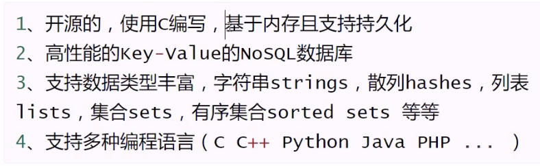
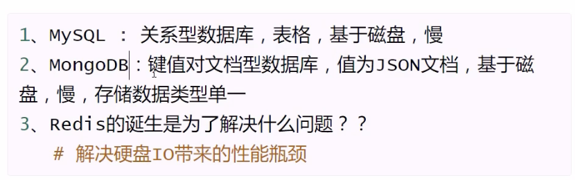
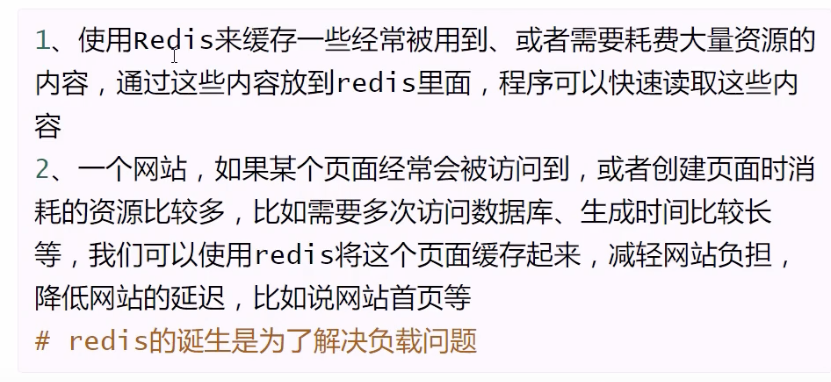
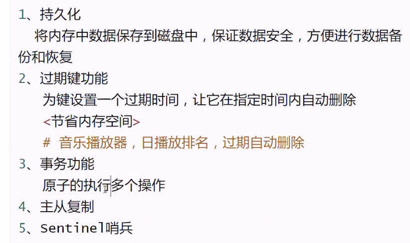

# Redis

## 特点及优点



## 与其他数据库对比



## 应用场景



## 附加功能



## 安装

**Ubuntu**

```shell
#安装
sudo apt-get install redis-server
#启动、停止、暂停
sudo /et/init.d/redis-server status | start| stop|restart
#客户端连接
redis-cli -h Ip -p 6379 -a password
```

## 通用命令，适用于所有数据类型

```shell
# 切换库 0-15
select number
#查看所有键
kyes 表达式
#数据类型
TYPE key
#键是否存在
exists key  
#删除键
dek key
#键重命名
rename key newkey
#清除当前库中所有数据
flushdb
#清除所有库中所有数据
flushll
```

# 字符串类型

- 特点
    - 1.字符串、数字、都会转为字符串来存储
    - 2.以二进制的方式存储在内存中

## 字符串常用命令 —必须掌握

```shell
set key value
get key
#key不存在时再进行设置
set key value nx
#设置过期时间(ex)
set key value ex seconds
#同时设置多个key-value
mset key1 value1 key2 value2 key3 value3
#同时获取多个key-value
mget key1 key2 key3
```

## 字符串常用命令 -了解

```shell
#获取字符串长度
strlen key
#获取指定范围切片内容
getrange key start stop
#从索引开始，value替换原内容
setrange key index value 
#追加拼接value的值
append key value
```

## 字符串数值操作-必须掌握

```shell
#整数操作
INCRBY key 步长
DECRBY key 步长
INCR key +1操作
DECR key -1操作
#应用场景：抖音上有人关注了你，是不是可以用INCR呢，如果取消了关注是不是可以用DECR
#浮点数操作：自动先转为数字操作，然后再进行相加减，不能使用append
incrbyfloat key stop
```

## 键的命名规范

```shell
mset wang:email wangwei@126.com kql:email kql@126.com
```

## string值取值原则

- key值不宜过长，消耗内存，且在数据中查找这类键值的计算成本高
- 不宜过短，可读性较差
- 一个字符串类型的值最多能存储512m内容。

# 列表

## 特点

    - 元素是字符串类型
    - 列表头尾增删快
    - 元素可重复
    - 最多可包含2^32-1个元素
    - 索引同python列表

## 常用命令

```
#增
#从头部压入元素
lpush key value1 value2 value3
#从尾部压入元素
rpush key value1 value2 value3
#从列表src尾部弹出一个元素，压入到列表dst的头部
rpoplpush src dst
# 在列表指定元素后/前插入元素
linsert key before|after value newvalue
#查
#查看列表元素
lrange key start stop
# 查看列表长度
llen key

#删
#从列表头部弹出一个元素
lpop key
#从列表尾部弹出一个元素
rpop key
#列表头部，阻塞弹出，列表为空时阻塞
brpop key timeout
#列表尾部，阻塞弹出，列表为空时阻塞
brpop key timeout

关于blpop和brpop说明：
1. 如果弹出的列表为空或不存在，就会阻塞
2. 超时时间设置为0，就是永久阻塞，直到有数据可以弹出
3. 如果多个客户端阻塞在同一个列表上，使用first in first service原则，即先到先得服务。

#删除指定元素
lrem key count value
count>0 表示从头部开始向表尾搜索，移除与value相等的元素，数量为count。
count<0 表示从尾部开始向头部搜索，移除与value相等的元素，数量为count。
count=0 移除表中所有value相等的值。

#保留指定范围内的元素
ltrim key start stop
应用场景：保留微博评论最后500条
ltrim weibo:comment 0 499

#改
lset key index newvalue
```

# Redis与Python交互

## 安装

```shell
# ubuntu
sudo pip3 install redis

windows
1. python -m pip install redis
2. pip install redis
```

## 使用流程

```python
import redis

r = redis.Redis(host='127.0.0.1', port=6379, db=0, password='123456')
```

通用命令代码——> redis_test

# 位图操作

## 定义：

1. 位图不是真正的数据类型，它是定义在字符串类型中
2. 一个字符串类型的值最多能存储512m字节的内容，位上限：2^32

   1MB = 1024KB
   1KB = 1024B
   1B=8bit

## 强势点

可以实时的进行统计，机器节省空间。官方模拟一亿二千八百万用户的模拟环境中，使用macbookpro，典型统计如“日用户数”的时间消耗小于50ms，占用内存16MB

```shell
#设置某一位上的值,(offset是偏移量，从0开始)
setbit key offset value


#获取某一位上的值
getbit key offset

#统计键所对应的值有多少个1,start和end都是bytes
bitcount key [start end]
```

## 应用场景

1. 用户签到
2. 统计用户活跃度
3. 统计用户活跃天数
4. 统计用户活跃小时数
5. 统计用户活跃分钟数
6. 网站用户的上线次数统计

# 哈希类型

## 定义：

1. 由field和关联的value组成的键值对
2. field和value是字符串类型
3. 一个hash中最多包含2^32个键值对

## 优点

1. 节约内存空间
2. 每创建一个键，他都会为这个键存储一些附加的管理信息（比如这个键的类型，这个键最后一次被访问的时间等）
3. 键越多，redis数据库在存储附件管理信息方面耗费内存越多，花在管理数据库键上的CPU也会越多。

## 缺点

1. 使用二进制位操作命令：SETBIT,GETBIT,BITCOUNT等，如果想使用这些操作，只能用字符串键。
2. 使用过期键功能：键过期功能只能对键进行过期操作，而不能对散列的字段进行过期操作。

## 基本命令操作

```shell
#1. 设置一个字段
hset key field value
hsetnx key field value
# 2. 设置多个字段
hmset key field value field value
# 3. 返回字段个数
hlen key
# 4. 判断字段是否存在
hexists key field
# 5. 返回字段值
hget key field
# 6. 返回多个字段值
hmget key field field
# 7 返回所有的键值对
hgetall key
# 8. 返回所有字段名
hkeys key
# 9. 返回所有值
hvals key
# 10. 删除指定字段
hdel key field
# 11. 在字段对应值上进行整数增量运算
hincrby key filed increment
# 12 在字段对应值上进行浮点数增量运算
hincrbyfloat key field increment
```

## 应用场景

```shell

微博好友关注
1. 用户id为key，field为好友id，value为关注时间
key      field      value
user:10  user:606   20230101

2. 用户维度统计
统计数：关注数、粉丝数、喜欢商品数、发帖数
用户为key 不同维度field，value为统计数
比如关注了5人
hset user:1000 fans 5
hincrby user:1000 fans 1
```

# redis+mysql联合使用

## 原理

```shell
用户要查询个人信息
1. 到redis缓存中查询
2. redis中查不到，到mysql查询，并缓存到redis
3. 再次查询个人信息
```

# 集合数据类型

## 特点

```shell
1. 无序、去重
2. 元素是字符串类型
3. 最多包含2^32-1个元素
```

## 基本命令

```shell
1. 增加一个活多个元素，自动去重
sadd key number1 number2
2. 查看集合元素
smembers key
3. 删除一个或多个元素，元素不存在自动忽略
srem key member1 member2
4. 元素是否存在
sismember key member
5. 随机返回集合中指定个数的元素，默认为1个
srandmember key [count]
6. 弹出成员
spop key [count]
7. 返回集合中元素的个数，不会遍历整个集合，只是存储在键当中了
scard key
8. 把元素从源集合移动到目标集合
smove source destination member
9. 差集(number1 1 2 3 number2 1 2 4 结果为3) 不同元素
sdiff key1 key2
10. 差集保存到另一个集合中
sdiffstore destination key1 key2
11. 交集 相同元素
sinter key1 key2
sinterstore destination key1 key2
12. 并集
sunionstore destination key1 key2
```

# 有序集合

## 特点

1. 有序、去重
2. 元素是字符串类型
3. 每个元素都关联着一个浮点数分值(score),并按照分值从小到大的顺序排列集合中的元素(分值可以相同)
4. 最多包含2^32-1个元素

## 有序集合常用命令

```shell
1. 在有序集合中添加一个成员
zadd key score member
2. 查看指定区间元素（升序）
zrange key start stop [withscores]
3. 查看指定区间元素（降序）
zrevrange key start stop [withscores]
4. 查看指定元素分值
zacore key member
5. 返回指定区间元素
#offset 跳过多少个元素
# count 返回几个
# 小括号开区间
zrangebyscore key min max [withscores] [limit offset count]

#每页显示10个成员，显示第5页的成员信息
limit 40 10
# 显示第3 4 5条记录
limit 2 3

6. 删除成员
zrem key member
7. 增加或减少分值
zincrby key increment member
8. 返回元素排名
zrank key member
9. 返回元素逆序排名
zrevrank key member
10. 删除指定区间内的元素
zremrangebyscore key min max
11 返回集合中元素个数
zcard key
12. 返回指定范围中元素个数
zcount key min max
zcount salary 6000 8000
zcount salary (6000 8000 #6000 <salary<=8000
zcount salary (6000 (8000 # 6000<salary<8000
13. 并集
zunionstore destination numkeys key [weights权重值] [aggregate sum|min|max]
zunionstore salary3 2 salary salary2 weights 1 0.5 aggregate max
#2代表集合数量，weights之后 权重1 给salary 权重0.5给salary2 算完权重之后再执行聚合aggregate
14 交集,和并集相似，只取相同的元素
zinterstore destination numkeys key1 key2 weights weight aggregate sum(默认)|min|max
```

# 总结

## 五大数据类型及应用场景

| 类型         | 特点                                           | 使用场景                                                      |
|------------|----------------------------------------------|-----------------------------------------------------------|
| string     | 简单key-value类型，<br/>value可为字符串和数字             | 常规计数（微博数，粉丝数等功能）                                          |
| hash       | string类型的field和value的映射表，<br/>hash特别适合用于存储对象 | 存储部分肯呢个需要变更的数据（比如用户信息）                                    |
| list       | 有序可重复列表                                      | 关注列表、粉丝列表、消息队列等                                           |
| set        | 无序不可重复列表                                     | 存储并计算关系（如微博、关注人或粉丝存放在集合，<br/>可通过交集、并集差集等操作实现共同关注、共同喜好等功能） |
| sorted set | 每个元素带有分值的集合                                  | 各种排行榜                                                     |

