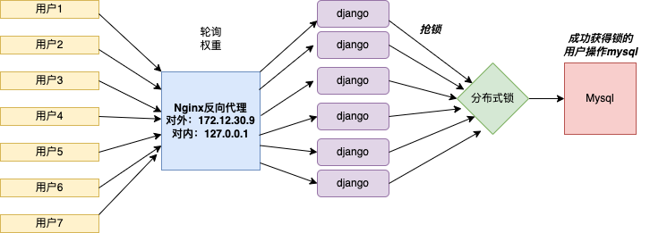

# 分布式锁

**高并发产生的问题**
```shell
1. 购票，多个用户抢到同一张票？
2. 购物，库存只剩一个，被多个用户成功买到？
```

**怎么办**
```shell
在不同进程需要互斥地的访问共享资源时，分布式锁是一种非常有用的技术手段
```
**原理**
1. 多个客户先到redis数据库中获取一把锁，色到锁的用户才可以操作数据库
2. 此用户操作完成后释放锁，下一个成功获取锁的用户再继续操作数据库。



## 应用
在django中，当多个用户同时对一个字段进行操作时加上分布式锁，在django修改数据的前面加上分布式锁
```shell
def get_request():
    import redis
    r = redis.Redis(host='127.0.0.1',port=6379,db=0)
    while True:
        try:
            #guokql为redis不存在的一个键，另一个参数为超出3秒获取不到锁，即报错
            with r.lock('guokql',blocking_timeout=3):
                u = UserFile.objects.get(username='guokql')
                u.score+=1
                u.save()
            break
        except Exception as e:
          print('Lock is failed')
    return Jsonresponse({'code':200})
        
```

# Redis事务
## 特点：
1. 单独的隔离操作：事务中的所有命令会被序列化、按顺序执行，在执行过程中不会被其他客户端发送来的命令打断
2. 不保证原子性：redis中的一个事务中如果存在命令执行失败，那么其他命令依然被执行，没有回滚机制

## 事务命令
```shell
1. MULTI #开启事务
2. 命令1 #执行命令
3. 命令2
4. EXEC # 提交到数据库执行
5. DISCARD # 取消事务
```
## 事务中命令错误处理


## 为什么redis不支持事务回滚？


# pipeline补充
**python使用pipeline()与execute()批量进行批量操作

示例

```python
import redis

# 创建连接池并连接到redis
pool = redis.ConnectionPool(host='127.0.0.1', db=0, port=6379)
r = redis.Redis(connection_pool=pool)

# 第一组
pipe = r.pipeline()
pipe.set('fans', 50)
pipe.incr('fans')
pipe.incrby('fans', 100)
pipe.execute()

# 第二组
pipe.get('fans')
pipe.get('pwd')
# [b'151',b'123']
result = pipe.execute()
print(result)
```


