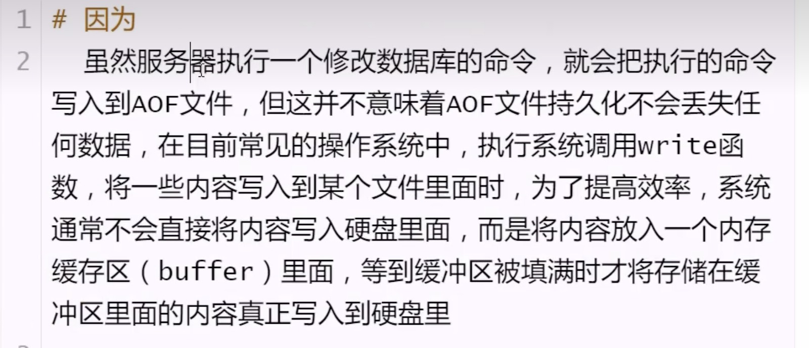

# 数据持久化

**定义**：

        将数据从掉电易失德内存放到永久存储的设备上  

**为什么需要持久化**

        因为所有的数据都在内存上，所以必须得持久化

# 数据持久化分类之—RDB模式(默认开启)

**默认模式**

        1. 保存真实的数据
        2. 将服务器包含的所有数据库数据以二进制文件的形式保存到硬盘里面
        3. 默认文件名：/var/lib/redis/dump.rdb

## 创建rdb文件的两种方式

### 方式一 服务器执行客户端发送的save或者bgsave命令

**save命令**

**特点**

```shell
save
1. 执行save命令过程中，redis服务器将被阻塞，无法处理客户端发送的命令请求，在save执行完毕后，服务器才会重新开始处理客户端发送的命令请求
2. 如果rdb文件已经存在，那么服务器将自动使用新的rdb文件代替旧的rdb文件。
```

**bgsave命令**

```shell
bgsave 
执行过程：
- 客户端发送bgsave给服务器
- 服务器马上返回 background saving started给客户端
- 服务器fork子进程做这件事
- 服务器继续提供服务
- 子进程创建完rdb文件后再告知redis服务器 
```

**配置文件相关操作**

etc/redis/redis.conf  
263行：dir /var/lib/redis 表示rdb文件存放路径  
253行：dbfilename dump.rdb 文件名

两个命令比较：save比bgsave快，因为需要创建子进程，消耗额外的内存  
补充:可以通过查看日志文件来查看redis都做了哪些操作  
日志文件  
logfile /var/log/redis/redis-server.log

## 方式二 设置配置文件条件满足时自动保存(使用最多)

```shell
save 300 10
表示数据库距离上一次创建rdb文件已经过去了300秒，并且服务器的所有数据库总共
已经发生了不少于10次修改，那么自动执行bgsave命令

save 60 10000 
表示数据库距离上一次创建rdb文件已经过去了60秒，并且服务器的所有数据库总共
已经发生了不少于10000次修改，那么自动执行bgsave命令


# redis配置文件默认
218行：save 900 1
219行：save 300 10
220行：save 60 10000

1. 只要三个条件中的任意一个被满足，服务器就会自动执行bgsave
2. 每次创建rdb文件之后，服务器为实现自动持久化而设置的计数器和次数计数器就会被清零，并重新开始
计数，所以多个保存条件的效果不会叠加。
```

# 数据持久化分类之—AOF模式(默认未开启)

## 特点

```shell
1. 存储的是命令，而不是真实的数据
2. 默认不开启
#开启方式
1. /etc/redis/redis.conf
672行：allendonly yes #把no改为yes
676行：appendfilename "appendonly.aof"
2. 重启服务
sudo /etc/init.d/redis-server restart
```

## rdb缺点

- 创建rdb文件需要将服务器所有的数据库的数据都保存起来，这是一个非常消耗资源和时间的操作，
  所以服务器需要隔一段时间才创建一个新的rdb文件，也就是说，创建rdb文件不能执行的过于频繁，否则会严重影响服务器的性能。
- 可能会丢失数据

## AOF持久化原理及优点

### 原理

1. 每当有修改数据库的命令被执行时，服务器就会将执行的命令写入到AOF文件的末尾
2. 因为AOF文件里面存储了服务器执行过的所有数据库修改的命令，所以给定一个AOF文件，服务器只要重新执行一遍AOF文件
   里面包含的所有命令，就可以达到还原数据库的目的

### 优点

用户可以根据自己的需要对AOF持久化进行调整，让redis在遭遇意外时不丢失任何数据，或者只丢失
一秒的数据，这比rdb持久化丢失的数据要少得多

### 安全性问题考虑




### 策略-配置文件

```shell
# 配置文件 /etc/redis/redis.conf
1. 701行 alwarys
服务器每写入一条命令，就将缓冲区里面的命令写入到硬盘里面，服务器就算意外停机，也不会丢失任何已经成功执行的命令。

2. 702行 everysec (默认)
服务器每一秒将缓冲区里面的命令写入到硬盘里面，这种模式下，服务器即使遭遇意外停机，最多只丢失1秒的数据。

3. 703行 no
服务器不主动讲命令写入硬盘，有操作系统决定何时将缓冲区的命令写入到硬盘里面，丢失命令数量不确定。

#运行速度比较
always 速度慢
everysec和no都很快，默认值为everysec，（一般不推荐no，使用everysec）
```

### AOF文件是否会产生很多的冗余命令

为了让AOF文件的大小控制在合理范围，避免胡乱增长，redis提供了AOF重写功能，通过这个功能，服务器可以产生  
一个新的AOF文件

1. 新的AOF文件记录的数据库数据和原有的AOF文件记录的数据库数据完全一样
2. 新的AOF文件会使用尽可能少的命令记录数据库数据，因此新的AOF文件的体积通常会小很多
3. AOF重写期间，服务器不会被阻塞，可以正常处理客户端发送的命令请求。

### AOF文件重写方法出发

1. 客户端向服务器发送bgrewriteaof命令  
   GBREWEITEAOF
2. 修改配置文件让服务器自动执行BGREWRITEAOF命令  
   auto-aof-rewrite-percentage 100  
   auto-aof-rewrite-min-size 64mb  
   解释：    
   只有当AOF文件的增量大于100%时才进行重写，也就是大一倍的时候才触发。

- 第一次重写新增 64M
- 第二次重写新增 128M
- 第三次重写新增 256M（新增128M）

# RDB和AOF持久化对比

| RDB持久化                       | AOF持久化                   |
|------------------------------|--------------------------|
| 全量备份，一次保存整个数据库               | 增量备份，一次保存一个修改数据库的命令      |
| 保存时间间隔较长                     | 保存时间默认为1秒                |
| 数据还原速度快                      | 数据还原速度一般，冗余命令多，还原速度慢     |
| 执行save命令会阻塞服务器，但手动或者自动触发不会阻塞 | 无论是平时还是进行AOF重写时，都不会阻塞服务器 |

注意：
```shell
用redis用来存储真正的数据，每一条数据都不能都是，都要用always，有的做缓存，有的保存真数据，我可以开多个redis服务，不同业务使用不同的持久化。
新浪每个服务器上有4个redis服务，整个业务有上千个redis服务，分不同的业务，每个业务的级别都是不一样的。
```

**数据恢复（无序手动操作）**  
既有dump.rdb,又有appendonly.aof,恢复时找谁？  
先找appendonly.aof  


      
      


