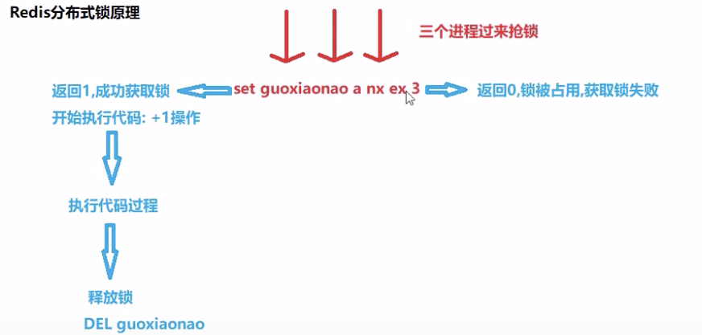

# 五大数据类型及应用场景

| 类型         | 特点                                           | 使用场景                                                      |
|------------|----------------------------------------------|-----------------------------------------------------------|
| string     | 简单key-value类型，<br/>value可为字符串和数字             | 常规计数（微博数，粉丝数等功能）                                          |
| hash       | string类型的field和value的映射表，<br/>hash特别适合用于存储对象 | 存储部分可能需要变更的数据（比如用户信息）                                     |
| list       | 有序可重复列表                                      | 关注列表、粉丝列表、消息队列等                                           |
| set        | 无序不可重集合                                      | 存储并计算关系（如微博、关注人或粉丝存放在集合，<br/>可通过交集、并集差集等操作实现共同关注、共同喜好等功能） |
| sorted set | 每个元素带有分值的集合                                  | 各种排行榜                                                     |


# Redis常见问题汇总
**redis优点**
```shell
1. 读写速度快
2. 支持数据类型丰富，string，hash，list，set，sorted
3. 支持事务
4. 可以用于缓存，消息队列，按key设置过期时间，到期后自动删除
5. 支持数据持久化（将内存数据持久化到磁盘），支持AOF和RDB两种方式持久化，从而进行数据恢复操作，可以有效地防止数据丢失
6. 支持主从（master-slave）复制来实现数据备份，主机会自动将数据同步到从机
```
**使用过redis分布式锁么，它是怎么回事?**
1. 从redis2.8开始，set命令集成了两个参数，nx和ex，先拿nx来争抢锁，抢到之后，再用ex参数给锁加一个过期时间防止锁无法释放，造成死锁。
2. redis分布式锁原理见图
set guoxiaonao aaa nx ex 3



## 缓存穿透
**原理**  
缓存和数据库都没有的数据，而用户反复发起请求，如，假的用户ID
场景  
比如发起为id为“-1”的数据或id为特别大的不存在的数据，这时的用户很可能就是攻击者，攻击会导致数据库压力过大。  
**解决方案**  
1. 请求拦截，接口层增加校验，如对id做基础校验，id<=0的直接拦截。
2. 都无法取到的数据时也可以将key-value对写为key-null，缓存有效时间比如30秒左右，这样可以防止攻击用户反复  
用同一个id暴力攻击

## 缓存击穿
**原理**  
缓存没有，数据库有，一般是缓存时间到期，顺势并发太大。  

**解决方案**  
1. 热点数据不过期
2. 上锁：重新设计缓存的使用方式，当我们通过key去查询数据时，首先查询缓存，如果没有，就通过分布式锁机型加锁，  
取得锁的进程查DB并设置缓存，然后解锁；其他进程如果发现有锁就等待，然后等解锁后返回缓存数据或者再次查询DB。


## 缓存雪崩
**原理**  
缓存中大批量数据过期，导致瞬时大批量不同请求注入DB  

**解决方案**  
1. 缓存设置随机时间（避免设置相近的有效期；为有效期增加随机值）
2. 热点数据不过期