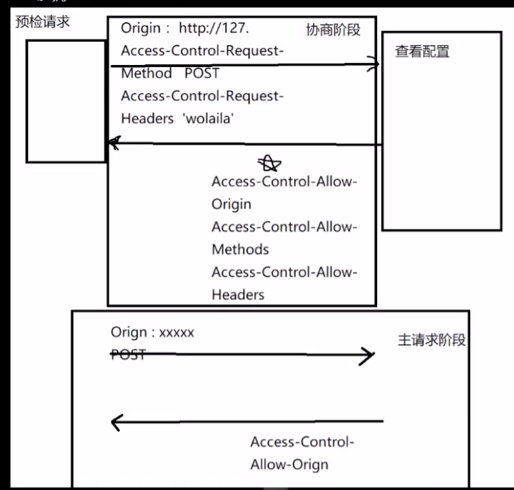

# CORS-Cross-origin resource sharing -跨域资源共享

————解决跨域最主流的方案

1. 什么是CORS  
   允许浏览器向跨源(协议+域名+端口)服务器，发出XMLHttpRequest请求，从而克服了AJAX只能同源使用的限制。
2. 特点

- 浏览器自动完成(在请求头中加入特殊头或发送特殊请求)
- 服务器需要支持(响应头重需要特殊头)

## CORS分类

### 简单请求(Simple requests)

满足一下全部条件的请求为简单请求：

1. 请求方法如下：

            GET or HEAD or POST        
2. 请求头只能包含以下字段：

           Accept
           Accept-Language
           Content-Language
           Content-Type
3. Content-Type 只允许三种格式：

             text/plain
             multipart/form-data
             application/x-www-form-urlencoded

注：不满足以上任意一点的请求都是预检请求。

4. 简单请求发送流程

- 请求  
  请求头重携带Origin，该字段表明自己来自哪个域
- 响应  
  如果响应请求头重的Origin在服务器接受范围内，则返回如下头：

| 响应头                              | 作用                                                                                                         | 备注 | 
|----------------------------------|------------------------------------------------------------------------------------------------------------|----|
| Access-Control-Allow-Origin      | 服务器支持的所有域                                                                                                  | 必选 |
| Access-Control-Allow-Credentials | 是否接受Cookie                                                                                                 | 可选 |
| Access-Control-Expose-Headers    | 默认情况下，xhr只能拿到如下响应头：Cache-Control,Content-Languahe,Content-Type, Expires,Last-Mofified；如果需要获取其他头，需要在此指定 | 可选 |

如果服务器不接受此域，则响应头重不包含Access-Control-Allow-Origin

### 预检请求/复杂请求(Preflighted requests)

#### 预检请求发送流程

1. OPTION请求发起，携带如下请求头

| 请求头                            | 作用        | 备注 |
|--------------------------------|-----------|----|
| Origin                         | 表明自己来自哪个域 | 必选 |
| Access-Control-Request-Method  | 此次请求使用方法  | 必选 |
| Access-Control-Request-Headers | 此次请求使用的头  | 可选 |

2. OPTION接受响应阶段，携带如下响应头

| 响应头                              | 作用               | 备注 |
|----------------------------------|------------------|----|
| Access-Control-Allow-Origin      | 表明服务器接受来自哪个域的请求  | 必选 |
| Access-Control-Allow-Methods     | 表明服务器接受哪些方法      | 必选 |
| Access-Control-Allow-Headers     | 返回所有支持的头部        | 必选 |
| Access-Control-Max-Age           | OPTION请求缓存时间，单位s | 可选 |
| Access-Control-Allow-Credentials | 是否接受Cookie       | 可选 |

3. 主请求阶段

| 请求头    | 作用        | 备注 |
|--------|-----------|----|
| Origin | 表明自己来自哪个域 | 必选 |

4. 主请求响应阶段

| 响应头                         | 作用              | 备注 |
|-----------------------------|-----------------|----|
| Access-Control-Allow-Origin | 表明服务器接受来自哪个域的请求 | 必选 |

5.流程图  

# Django支持

## 配置流程

1. 安装离线包

方法1：
步骤1： 下载离线包 https://pypi.org/project/django-cors-headers/  
步骤2： 解压离线包，进入解压后的文件夹，执行命令

         tar -xvf django-cors-headers-3.0.2.tar.gz  

步骤3：

         cd django-cors-headers-3.0.2/  

步骤4：

      python3 setup.py install  

方法2：

         pip install django-cors-headers==version

步骤5：

         pip3 freeze|grep 'cors'

如果出现cors-3.0.2字样，则安装成功

2. 配置settings.py

         1. INSTALLED_APPS中添加 'corsheaders',
         2. MIDDLEWARE中添加'corsheaders.middleware.CorsMiddleware', #放在最前面,在django.middleware.common.CommonMiddleware之上
         3. CORS_ORIGIN_ALLOW_ALL = True  # 如果为True，则将不使用白名单，并且将接受所有来源。默认为False
         4. CORS_ORIGIN_WHITELIST = [] # 允许的来源列表，默认为空列表，即不限制来源
         注意：3和4是一个if-else的逻辑关系，3为true，则不走4
         5. CORS_ALLOW_METHODS = ('DELETE', 'GET', 'OPTIONS', 'PATCH', 'POST', 'PUT' )  #实际请求所允许的HTTP动词列表
         6. CORS_ALLOW_HEADERS = ('accept', 'accept-encoding', 'authorization', 'content-type', 'dnt', 'origin', 'user-agent', 'x-csrftoken', 'x-requested-with')  #实际请求所允许的HTTP标头
         7. CORS_PREFLIGHT_MAX_AGE = 86400  #预检请求缓存时间，单位秒，默认为86400秒（1天）,即在该时间段内，当前的域不必再发送预检请求，直接发送主请求.
         8. CORS_EXPOSE_HEADERS = ()  #预检请求所允许的HTTP标头
         9. CORS_ALLOW_CREDENTIALS = False  #是否允许请求带有验证信息，则将允许将cookie包含在跨站点HTTP请求中。默认为False

         

