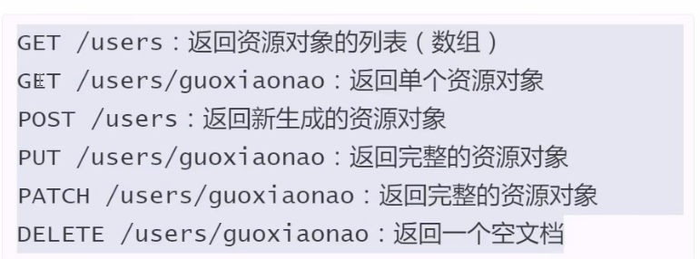

# RESTful-Representational State Transfer

---author: Roy Fielding (restful/http)

## 什么是RESTful

- 资源(Resources)  
  网络上的一个实体，或者说是网络上的一个具体信息，并且每个资源都有独一无二的URI与之对应；获取资源-直接访问URI即可
- 表现层  
  如何去表现资源，-即资源得表现形式；如HTML,xml,JPG.json等
- 状态转化  
  访问一个URI即发生了一次客户端和服务端得交互；此次交互将会涉及到数据和状态得变化。  
  客户端需要通过某些方式出发具体得变化-HTTP method 如GET、POST、PUT、PATCH、DELETE等。

## RESTful特征

- 每一个URI代表一种资源。
- 客户端与服务端之间传递着资源得某种表现。
- 客户端通过HTTP的几个动作 对资源进行操作-发生状态转化。

## 设计符合RESTful特征的API

1. 协议 -http/https
2. 域名，域名中出现api字样，如

        https://api.example.com or https://exam.org/api/
3. 版本

        https://api.example/v1/
4. 路径-路径中避免使用动词，资源用名词表示，案例如下

        https://api.example.com/v1/users
        https://api.example.com/v1/animals

5. HTTP动词语义

- GET：从服务器获取资源（一项和多项）
- POST：从服务器新建一个资源
- PUT：在服务器更新资源（客户端提供改变后的完整资源）
- PATCH：在服务器更新资源(客户端提供改变的属性)
- DELETE:从服务器删除资源

6. 巧用查询字符串

        ?limit=10 指定返回记录的数量
        ?offset=10 指定返回记录的开始位置
        ?page=2&per_page=100 指定第几页，以及每页的记录数
        ?sortby=name&order=asc 指定返回按照哪个属性排序，以及排序顺序
        ?type+id=1 指定筛选条件
7. 状态码

        200 OK [GET] 服务器成功返回用户请求的数据
        201 CREATED [POST/PUT/PATCH] 用户新建或修改数据成功
        202 Accepted [*] 表示一个请求已经进入后台排队
        204 NO CONTENT [DELETE] 用户删除数据成功
        400 INVALID REQUEST [POST/PUT/PATCH] 用户发出的请求有错误，服务器没有进行新建或修改数据的操作，该操作时幂等的
        401 Unauthorized [*] 表示用户没有权限(令牌、用户名、密码错误)
        403 Forbidden [*] 表示用户得到权限（与401错误相对），但是访问是被禁止的
        404 NOT FOUND [*] 用户发出的请求针对的是不存在的记录，服务器没有进行操作，该操作时幂等的。
        406 Not Acceptable [GET] 用户请求的格式不可得（比如用户请求JSON格式，但是只有XML格式）
        410 Gone [GET] 用户请求的资源被永久删除，且不会再得到的
        422 Unprocesable entity [POST/PUT/PATCH] 当创建一个对象时，发生一个验证错误。
        500 INTERNAL SERVER ERROR [*] 服务器发生错误

        2. 自定义内部code进行响应
         如返回结构如下 {'code':200,'data':[],'error':'xxx'}

8. 返回结果

根据HTTP动作的不同，返回结果的结构也有所不同  

            

