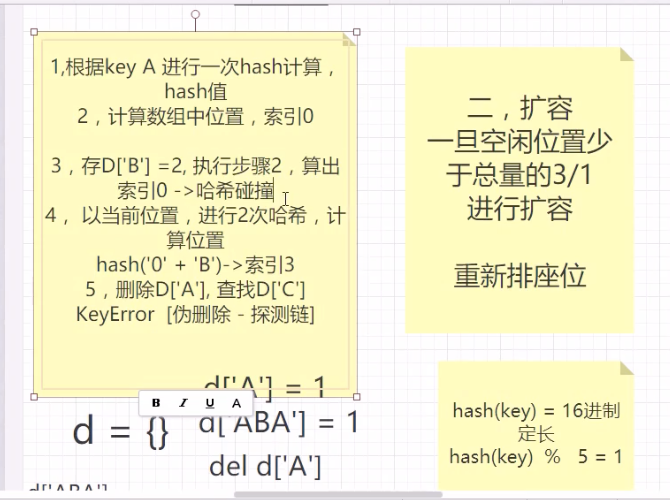

# Token-令牌

## base64 '防君子不防小人'

| 方法                | 作用                            | 参数                |
|-------------------|-------------------------------|-------------------|
| b64encode         | 将输入的参数转化为base64规则的串           | 预加密的明文，类型为bytes   |
| b64decode         | 将base64串解密回明文                 | base64密文，类型为bytes |
| urlsafe_b64encode | 作用同b64encode，但是会将+替换成-，将/替换成_ | 同base64encode     |
| urlsafe_b64decode | 作用同b64decode                  | 同base64decode     |

base64加密原理：

- 将字符串拆成每三个字符一组
- 计算每一个字段对应的ASCII码二进制。(每一个字符对应的ASCII码为8位二进制)
- 将8位的二进制码，按照每6位一组重新分组，不足6位的在后面补0。
- 计算对应的十进制编码
- 按照base64表，查看对应的字符。

            import base64
            s = b'guokanqilu'
            #加密
            b_s = base64.b64encode(s)
    
            #解密
            b_s = base64.b64decode(b_s)

## SHA-256 安全散列算法的一种(hash)

hash 三大特点：

- 确定性(定长输出) ：对于任何给定的输入，哈希函数总是产生相同的输出。 
- 不可逆、在有限时间内，很难推出明文。
- 雪崩:哈希函数对输入的微小变化都产生显著的输出变化。

```python
import hashlib

# 创建sha256对象
s = hashlib.sha256()
# 添加hash的内容，类型为bytes
s.update(b'xxxxx')
# 获取最终结果,输出二进制
s.digest()
# 获取最终结果,输出十六进制
s.hexdigest()
```

**字典底层原理**



注意：字典是拿空间换时间的一个典型例子，其遇到哈希碰撞时的处理方案是进行二次哈希。

## HMAC-SHA256

HMAC 是一种通过特别计算方式之后产生的消息认证码，使用散列算法同时 结合一个机密密钥。它可以用来保证数据的完整性，同时  
可以用来做某个消息的身份认证。

```python
import hmac

'''
生成hmac对象
第一个参数为加密的key，bytes类型
第二个参数为加密的串，bytes类型
第三个参数为加密的算法，默认sha1，指定为SHA256
'''
key = '12245'
h = hmac.new(key, str, digestmod='SHA256')
# 获取最终结果，二进制
h.digest()
# 获取最终结果,十六进制
h.hexdigest()
```

## RSA256非对称加密

RSA 非对称加密算法，是一种公钥加密技术，其加密和解密都使用同一个密钥。

- 加密：公钥加密，私钥解密
- 签名：私钥签名，公钥验签

## JWT-json-web-token

**三大组成**

1. header
   格式为字典-元数据格式如下

        {'alg':'HS256','typ':'JWT'}
        #alg代表要使用的算法。
        #typ表明该token的类别 - 此处必须为大写的JWT。
        注：该部分数据需要转成json串并用base64加密。
2. payload
   格式为字典-此部分分为公有声明和私有声明。

公共声明：JWT提供了内置关键字用于描述常见的问题，此部分均为可选项，用户根据自己需求，按需添加key，常见公共声明如下：

            {
                'exp': xxx,  # 此token过期时间的时间戳
                'iss': xxx,  # 指明此token的签发者
                'aud': xxx,  # 指明此token所面向的群体
                'iat': xxx,  # 指明此创建时间的时间戳
            }

私有声明：用户可根据自己业务需求，添加自定义的key，注意：key值必须为字符串类型，且不能以下划线开头。

        {'username': 'kql123'}

公共声明和私有声明均在同一个字典中，转成json串并用base64加密。

3. signature 签名
   签名规则如下：
   根据header中的alg确定具体算法，以下用HS256算法为例，签名规则如下：
   HS256(自定义的key + base64(header) + base64(payload))

解释：用自定义的key对base64后的header+'.'+base64后的payload进行hmac计算。

4. jwt结果格式

base64(header) + '.' + base64(payload) + '.' + base64(sign)

5. 校验jwt规则

- 解析header，确认alg
- 签名校验-根据传过来的header和payload按alg指明的算法进行签名，将签名结果和传过来的sign进行对比，若对比一致，则校验通过
- 获取payload自定义内容。

## Pyjwt

**安装**

        pip3 install pyjwt

| 方法                            | 参数说明                                                                                                                                                                                                                                 | 返回值               |
|-------------------------------|--------------------------------------------------------------------------------------------------------------------------------------------------------------------------------------------------------------------------------------|-------------------|
| encode(payload,key,algorithm) | payload:jwt三大组成中的payload,<br/>需要组成字典，按需添加公有声明和私有声明<br/>key:自定义的加密key，参数类型：str                                                                                                                                                        | token串，返回类型：bytes |
| decode(payload,key,algorithm) | token:token串，参数类型：bytes/str，<br/>key:自定义的加密key，需要跟encode中的key保持一致<br/>参数类型：str <br/>algorithm：同encode<br/>issuer：发布者，<br/>若encode payload中添加iss字段，则可针对该字段校验，参数类型：str<br/>audience：签发的受众群体，若encode payload中添加aud字段，则可针对该字段校验，参数类型：str | payload返回类型：dict  |

**注意**：若encode的时候payload中添加了exp字段；则exp字段得值需为当前时间戳+此token的有效期时间，  
例如希望token300秒后过期 {'exp': time.time() + 300}  


        
        payload = {'username': 'kql', 'exp': time.time() + 15}
        
        # 生成token
        a = jwt.encode(payload, '123456', algorithm='HS256')
        print(a)
        
        # 解码token
        b = jwt.decode(a, '123456', algorithms='HS256')
        print(b)
        在执行decode时，若检查exp字段，且token过期，则抛出jwt.ExpiredSignatureError


 
