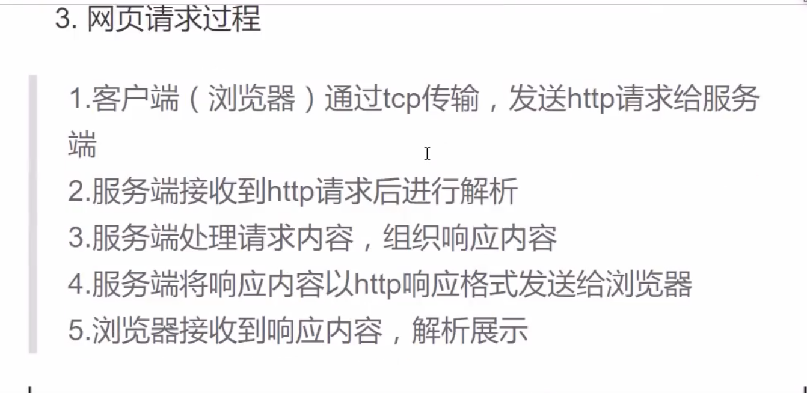
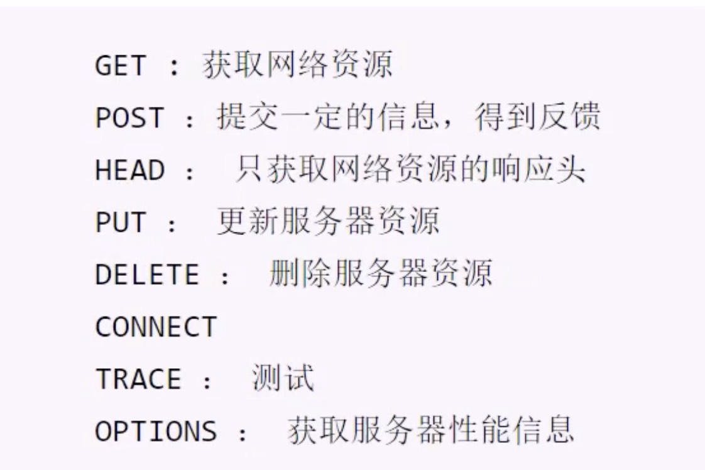

# OSI七层模型

指定组织：ISO

作用：使网络通信工作流程标准化。

- 应用层： 提供用户服务，具体功能有应用程序实现
- 表示层：数据的压缩优化加密。
- 会话层：建立用户级的连接，选择适当的传输服务。
- 传输层：提供传输服务
- 网络层：路由选择，网络互联。
- 链路层：进行数据交换，控制具体的数据的发送。
- 物理层：提供数据传输的硬件保证，网卡接口，传输介质。

**优点：**

1. 建立统一的工作流程。
2. 分部清晰，各司其职，每个步骤分工明确。
3. 降低了各个模块的耦合度，便于开发。

编程基本原则：高内聚，低耦合。

# 四层模型（TCP/IP模型）

背景：实际情况下工程师无法完全按照七层模型要求操作，逐渐演化为更符合实际情况的四层。


## 数据传输过程

1. 发送端由应用程序发送消息，最终在物理层发送消息包。
2. 发送的消息经过多个节点（交换机，路由器）传输，最终到达目标主机。
3. 目标主机由物理层逐层解析首部消息包，最终到应用呈现消息。


## 网络协议

在网络数据传输中，都遵循的规定，包括建立什么样的数据结构，什么样的特殊标志等。

## 网络基础概念

**IP地址**

功能：确定一台主机的网络路由位置。

查看本机网络地址命令：ifconfig

结构：IPv4点十分制表示172.198.91.185每部分取值0-255。

IPv6 128位扩大了地址范围。

**域名**

定义：给网络服务器地址取名字。

作用：方便记忆，表达一定的含义。

ping[ip] 测试和某个主机是否联通。

**端口号**

作用：端口是网络地址的一部分，用于区分主机上不同的网络应用程序。

特点：一个系统中的应用监听端口不能重复。

取值范围：1--65535

1-1023 系统应用或大众应用程序监听端口。

1024-65535 自用端口。（推荐10000以上）

## 传输层服务

### 面向连接的传输服务(基于TCP协议的数据传输)

1. 传输特征：提供了可靠的数据传输，可靠性指数据传输过程无丢失，无失序，无差错，无重复。
2. 实现手段：在通信前需要建立数据连接，通信结束要正常断开连接。

#### 三次握手

    客户端向服务器发送消息报文请求连接。
    服务器收到请求后，回复报文确定可以连接。
    客户端收到回复，发送最终报文连接建立。


#### 四次挥手(断开连接)

    主动方发送报文请求断开连接。
    被动方收到请求后，立即回复，表示准备断开。
    被动方准备就绪，再次发送报文表示可以断开。
    主动方收到确定，发送最终报文完成断开。


**适用情况：**
对数据传输准确性有明确的要求，传输文件较大，需确定可靠性的情况。比如：网页获取，文件下载，邮件收发。

### 面向无连接的传输服务(基于UDP协议的数据传输)

1. 传输特点：不保证传输的可靠性，传输过程没有连接和断开，数据收发自由随意。
2. 适用情况：网络较差，对传输可靠性要求不高。比如：网络视频，群聊，广播。

### UDP套接字广播

- 广播定义：一端发送多点接收。
- 广播地址：每个网络的最大地址为发送广播的地址，向该地址发送，则网段内所有主机都能发送。

### TCP套接字之HTTP传输

#### HTTP协议（超文本传输协议）

1. 用途： 网页获取。
2. 特点：

- 应用层协议，传输层使用tcp传输。
- 简单，灵活，很多语言都有HTTP专门接口
- 无状态，协议不记录传输内容
- http1.1支持持久连接，丰富了请求类型。

#### 网页请求过程



### 面试要求

- OSI七层模型介绍一下，tcp/ip模型是什么？
- tcp服务和udp服务有什么区别？
- 三次握手和四次握手指什么，过程是怎样的？

### HTTP请求

- 请求行：具体的请求类别和请求内容

        GE           /         HTTP/1.1
        请求类别     请求内容    协议版本


- 请求类别：每个请求类别表示要做不同的事情
  

- 请求头：对请求的进一步解释和描述

      Accept-Encoding:gzip
- 空行
- 请求体：请求参数或者提交的内容

### HTTP响应

1. 响应格式：响应行，响应头，空行，响应体

- 响应行：反馈基本的响应情况  
  HTTP/1.1 200 OK 版本信息 响应码 附加信息

响应码：  
1xx：提示信息，表示请求被接收。 2xx：响应成功 3xx：响应需要进一步操作，重定向 4xx：客户端错误 5xx：服务端错误

- 响应头：对响应内容的描述  
  Content-Type: text/html

- 响应体：响应的主体内容信息

### struct模块的使用

1. 原理：将一组简单数据进行打包，转换为bytes格式发送。或者将一组bytes格式数据，进行解析。
2. 接口使用

         Struct(fmt)
         功能：生成结构化对象
         参数：fmt 定制的数据结构
      
         st.pack(v1,v2,v3...)
         功能：将一组数据按照指定格式打包转换为bytes
         参数:要打包的数据。
         返回值：bytes字节串。
         
         st.unpack(bytes_data) 
         功能：将bytes字节串按照指定的格式解析
         参数：要解析的字节串。
         返回值：解析后的内容

        也可以这样调用:
        struct.pack(fmt,v1,v2,v3)
        struct.unpack(fmt,bytes_data)

说明：可以使用struct模块直接调用pack unpack。此时这两个函数第一个参数传入fmt。其他用法功能相同。

```python
import struct

data = struct.pack('i4sf', 1, b'lilu', 1.23)

struct.unpack('i4sf', data)

(1, b'lilu', 1.2300000190734863)
```
           
   
    

