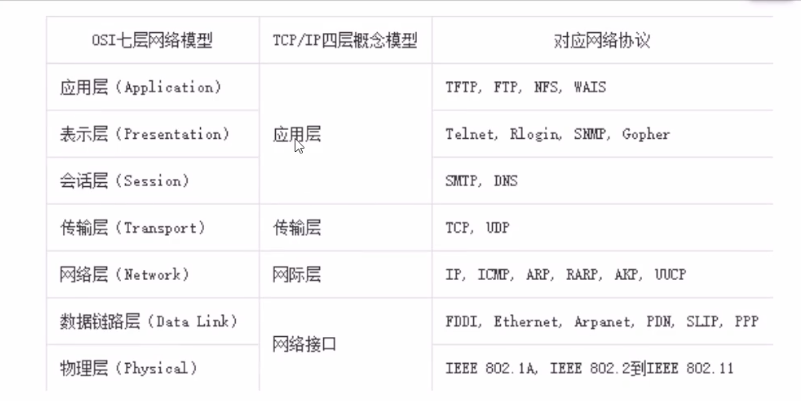
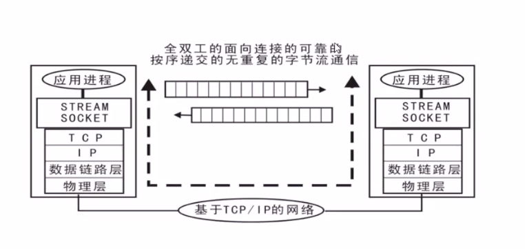
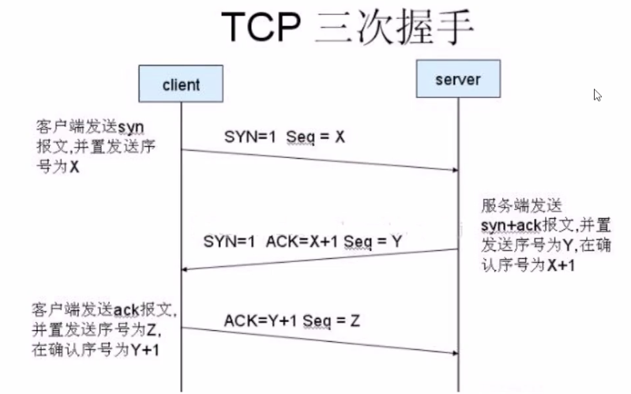
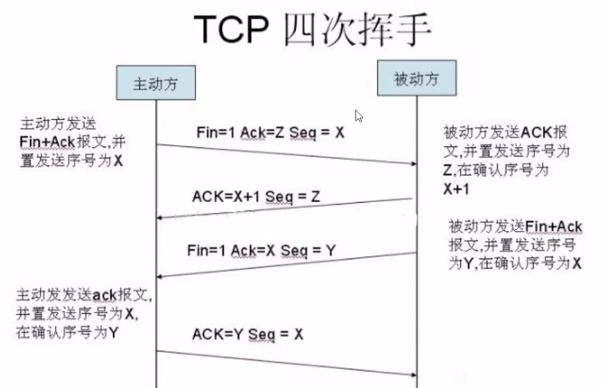

# OSI七层模型
指定组织：ISO 

作用：使网络通信工作流程标准化。
- 应用层： 提供用户服务，具体功能有应用程序实现
- 表示层：数据的压缩优化加密。
- 会话层：建立用户级的连接，选择适当的传输服务。
- 传输层：提供传输服务
- 网络层：路由选择，网络互联。
- 链路层：进行数据交换，控制具体的数据的发送。
- 物理层：提供数据传输的硬件保证，网卡接口，传输介质。

**优点：**
1. 建立统一的工作流程。
2. 分部清晰，各司其职，每个步骤分工明确。
3. 降低了各个模块的耦合度，便于开发。

编程基本原则：高内聚，低耦合。

# 四层模型（TCP/IP模型）
背景：实际情况下工程师无法完全按照七层模型要求操作，逐渐演化为更符合实际情况的四层。

## 数据传输过程
1. 发送端由应用程序发送消息，最终在物理层发送消息包。
2. 发送的消息经过多个节点（交换机，路由器）传输，最终到达目标主机。
3. 目标主机由物理层逐层解析首部消息包，最终到应用呈现消息。 

## 网络协议
在网络数据传输中，都遵循的规定，包括建立什么样的数据结构，什么样的特殊标志等。
## 网络基础概念
**IP地址** 

功能：确定一台主机的网络路由位置。 

查看本机网络地址命令：ifconfig

结构：IPv4点十分制表示172.198.91.185每部分取值0-255。 

IPv6 128位扩大了地址范围。

**域名** 

定义：给网络服务器地址取名字。 

作用：方便记忆，表达一定的含义。 

ping[ip] 测试和某个主机是否联通。

**端口号** 

作用：端口是网络地址的一部分，用于区分主机上不同的网络应用程序。 

特点：一个系统中的应用监听端口不能重复。 

取值范围：1--65535 

1-1023 系统应用或大众应用程序监听端口。

1024-65535 自用端口。（推荐10000以上）

## 传输层服务
### 面向连接的传输服务(基于TCP协议的数据传输)
1. 传输特征：提供了可靠的数据传输，可靠性指数据传输过程无丢失，无失序，无差错，无重复。
2. 实现手段：在通信前需要建立数据连接，通信结束要正常断开连接。
#### 三次握手
    客户端向服务器发送消息报文请求连接。
    服务器收到请求后，回复报文确定可以连接。
    客户端收到回复，发送最终报文连接建立。

#### 四次挥手(断开连接)
    主动方发送报文请求断开连接。
    被动方收到请求后，立即回复，表示准备断开。
    被动方准备就绪，再次发送报文表示可以断开。
    主动方收到确定，发送最终报文完成断开。

**适用情况：**
对数据传输准确性有明确的要求，传输文件较大，需确定可靠性的情况。比如：网页获取，文件下载，邮件收发。

### 面向无连接的传输服务(基于UDP协议的数据传输)
1. 传输特点：不保证传输的可靠性，传输过程没有连接和断开，数据收发自由随意。
2. 适用情况：网络较差，对传输可靠性要求不高。比如：网络视频，群聊，广播。 

### 面试要求
- OSI七层模型介绍一下，tcp/ip模型是什么？
- tcp服务和udp服务有什么区别？
- 三次握手和四次握手指什么，过程是怎样的？

