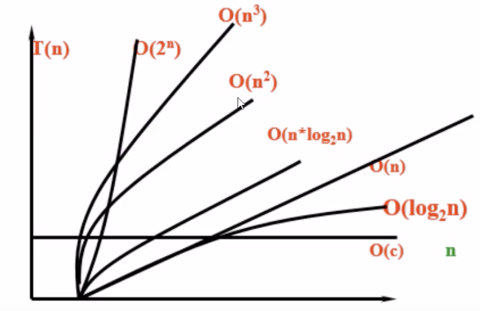

# 算法基础

## 基础概念特征

### 1. 定义

算法是一个有穷规则（或语句、指令）的有序集合。它确定了解决某一问题的一个运算序列。对于问题的初始输入，通过算法有限步的运行，产生一个或多个输出。

数据的逻辑与存储结构密切相关：

- 算法设计：取决于选定的逻辑结构。

- 算法实现：依赖于采用的存储结构。

### 2. 算法的特性

- 有穷性—算法执行的步骤（或规则）是有限的；

- 确定性—每个计算步骤无二义性；

- 可行性—每个计算步骤能够在有限的时间内完成；

- 输入、输出—存在数据的输入和输出。

### 3. 评价算法好坏的方法

- 正确性：运行正确是一个算法的前提。

- 可读性：容易理解、容易编程和调试。

- 健壮性：考虑情况全面，不容易出现运行错误。

- 时间效率高：算法消耗时间少。

- 存储量低：占用较少的存储空间。

## 时间复杂度和空间复杂度


算法是指用来操作数据、解决程序问题的一组的方法。对于同一个问题，使用不同的算法，也许最终得到的结果是一样的，但是在过程中消耗的资源和时间却会有很大的区别。  
如何衡量不同算法之间的优劣？ 主要还是从**时间**和**空间**两个维度去考量。  

**时间复杂度**  

算法效率—用依据该算法编制的程序在计算机上执行所消耗的时间来度量。“O”表示一个数量级的概念。根据算法中语句执行的最大次数(频度)来估算一个算法执行时间的数量级。

- 计算方法： 写出程序中所有运算语句执行的次数，进行加和，如果得到的结果是常量，则时间复杂度为1，如果得到的结果存在变量n则取n的最高次幂作为时间复杂度。

下图表示随问题规模n的增大，算法执行时间的增长率。  

   

**空间复杂度**  

既然时间复杂度不是用来计算程序具体耗时的，那么我也应该明白，空间复杂度也不是用来计算程序实际占用的空间的。
空间复杂度是对一个算法在运行过程中临时占用存储空间大小的一个量度，同样反映的是一个趋势，我们用 S(n) 来定义。
空间复杂度比较常用的有：O(1)、O(n)、O(n²)，我们下面来看看：  

空间复杂度 O(1)  

如果算法执行所需要的临时空间不随着某个变量n的大小而变化，即此算法空间复杂度为一个常量，可表示为 O(1)
```C
int i = 1;
int j = 2;
++i;
j++;
int m = i + j;
```
代码中的 i、j、m 所分配的空间都不随着处理数据量变化，因此它的空间复杂度 S(n) = O(1)  

空间复杂度 O(n)  
```C
int[] m = new int[n]
for(i=1; i<=n; ++i)
{
   j = i;
   j++;
}
``` 
这段代码中，第一行new了一个数组出来，这个数据占用的大小为n，这段代码的2-6行，虽然有循环，但没有再分配新的空间，  
因此，这段代码的空间复杂度主要看第一行即可，即 S(n) = O(n)


## 排序

排序是将无序的记录序列（或称文件）调整成有序的序列。

**常见的排序方法：**

- 冒泡排序
  
  冒泡排序是一种简单的排序算法。它重复地走访要排序的数列，一次比较两个元素，如果他们的顺序错误就把他们交换过来。走访数列的工作是重复地进行直到没有再交换，也就是说该数列已经排序完成。

- 选择排序
  
  工作原理：类似于打擂台，通过确定一个最大值或最小值，再从待排序的数中找出最大或最小值，之后再交换到对应位置。在选择次之。双重循环时间复杂度为O(n^2)。

  描述：在长度为n的无序数组中，第一次遍历n-1个数找到最小值和第一个数交换。第二次从下一个数开始遍历n-2个数，找到最小的数和第二个数据交换，重复以上步骤，直到第n-1次遍历最小的数和第n-1个数交换，排序完成。

- 插值排序
  
  工作原理：将待排序序列第一个元素看做一个有序序列，把第二个元素到最后一个元素当成未排序序列。从头到尾依次扫描未排序序列，将扫描到的每个元素插入有序序列的适当位置。（如果待插入的元素与有序序列的某个元素相等，则将待插入元素插入到相等元素的后面）

- 快速排序
  
  快速排序是排除稳定性因素后最常用的排序。描述：从数列中挑出一个元素作为基准；重新排列数列，把所有的比基准小的放在基准前面，反之放在后面(一样大可任意一边)完成后基准处在分区的中间位置；通过递归调用把小于基准元素和大于基准元素的子序列进行排序。