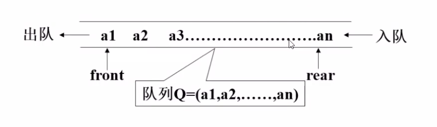

# 队列

## 1. 定义

队列是限制在两端进行插入和删除操作操作的线性表，允许进行存入操作的一端称为“队尾”，允许进行删除操作的一端称为“队头”。

## 2. 特点

- 队列只能在队头和队尾进行数据操作

- 队列模型具有先进先出或者叫做后进后出的规律。

## 3. 队列的代码实现

队列的操作有入队，出队判断队列的空满等操作。

- 顺序存储代码实现： squeue.py

- 链式存储代码实现：lqueue.py
