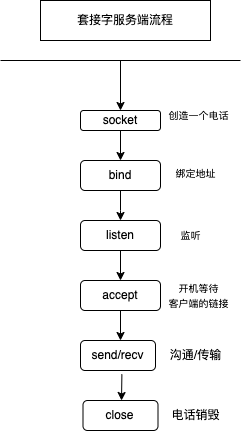
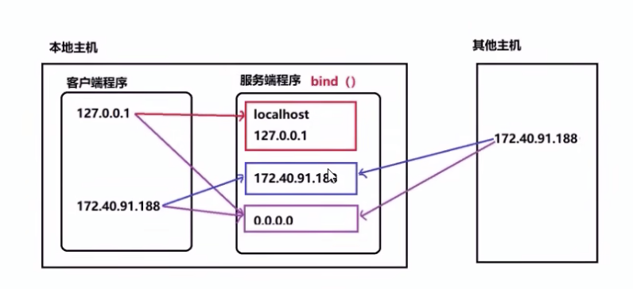
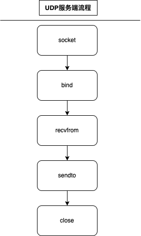

# 套接字编程

## 套接字介绍

1. 套接字：实现网络编程进行数据传输的一种技术手段
2. Python实现套接字编程：import socket
3. 套接字分类

    - 流式套接字（SOCK_STREAM）:以字节流传输数据，实现tcp网络传输方案。（面向连接--tcp协议--可靠的--流式套接字）
    - 数据报套接字（SOCK_DGRAM）:以数据报形式传输数据，实现udp网络传输方案。（无连接--udp协议--不可靠--数据报套接字）

4. 服务端流程

# TCP客户端与服务端

## 代码实现

### 1. 创建套接字

      import socket
      sockfd = socket.socket(socket_famliy=AF_INET, socket_type=SOCK_STREAM, protp=0)
      功能：创建套接字。
      参数：
      socket_famliy:网络地址类型，AF_INET表示ipv4
      socket_type:套接字类型，SOCK_STREAM(流式)，SOCK_DGRAM(数据报)
      proto：通常为0，选择子协议
      返回值：套接字对象。

### 2. 绑定地址

本地地址：'localhost','127.0.0.1'  
网络地址：'172.12.38.98'  
自动获取地址：'0.0.0.0'或''

      sockfd.bind(addr)
      功能：绑定本机网络地址
      参数：二元元组(ip,addr),('0.0.0.0',8888)

### 3. 设置监听

      sockfd.listen(n)
      功能：将套接字设置为监听套接字，确定监听队列大小。
      参数：监听队列大小

### 4. 等待客户端连接请求

      connection,adress = sockfd.accept()
      功能：阻塞等待处理客户端请求，服务器通过它与客户端通信
      返回值：connection 新的socker对象
             addr 客户端的internet地址

### 5.消息收发

      client_data = connection.recv(buffersize=1024)
      功能：接受客户端消息
      参数：每次最多接受消息的大小。
      返回值：接受到的内容
      
      connection.send(data)
      功能：发送消息
      参数：要发送的内容，bytes格式
      返回值： 发送的字节数

### 6. 关闭套接字

      
      #关闭客户端连接
      connection.close()
      关闭socket连接
      sockfd.close()
      功能：关闭套接字。

## tcp套接字数据传输特点

- tcp连接中当一端退出，另一端如果阻塞在recv，此时recv会立即返回一个空字符串。
- tcp连接中如果一端已经不存在，仍然视图通过send发送则会产生BrokenPipeError。
- 一个监听套接字可以同时连接多个客户端，也能够重复被连接。

## 网络收发缓冲区

1. 网络缓冲区有效的协调了消息的收发速度。
2. send和recv实际是向缓冲区发送接收消息，当缓冲区不为空recv就不会阻塞。

## TCP粘包

原因：tcp以字节流方式进行传输，没有消息边界。多次发送的消息被一次接受，此时就会形成粘包。  
影响：如果每次发送内容是一个独立的含义，需要接受端独立解析，此时粘包会有影响。  
解决方法：

- 人为的添加消息边界。
- 控制发送速度。

# UDP客户端与服务端

## 服务流程

### 1. 创建数据报套接字

      sockfd = socket(AF_INET,SOCK_DGRAM)
### 2. 绑定地址
      sockfd.bind(addr)
### 3. 消息收发
      data,addr = sockfd.recvfrom(buffersize)
      功能：接收UDP消息
      参数：每次做多接收多少字节
      返回值：data 接收到的内容
            addr 消息发送方地址

      n = sockfd.sendto(data,addr)
      功能：发送UDP消息
      参数：data：发送的内容，bytes格式
            addr：目标地址。
      返回值：发送的字节数。

### 4. 关闭套接字
      sockfd.close()

udp套接字不会产生粘包问题

      