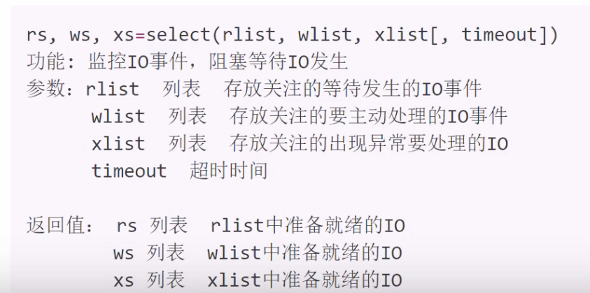
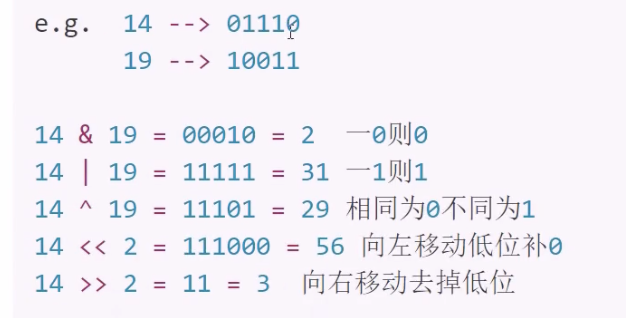

# IO分类

IO分类：阻塞IO，非阻塞IO，IO多路复用，异步IO等。

## 阻塞IO

1. 定义： 在执行IO操作时如果执行条件不满足则阻塞，阻塞IO是IO默认形态
2. 效率：阻塞IO是效率很低的一种IO。但是由于逻辑简单所以是默认IO行为。
3. 阻塞情况：
    - 因为某种执行条件没有满足造成的函数阻塞
        - a.g,accept,input,recv
    - 处理IO的时间较长产生的阻塞状态
        - e.g，网络传输，大文件读写

## 非阻塞IO

1. 定义：通过修改IO属性行为，使原本阻塞的IO变为非阻塞的状态。

- 设置套接字为非阻塞IO

            sockfd.setblocking(bool)
            功能：设置套接字为非阻塞IO
            参数：默认True，表示套接字IO阻塞，设置为False则套接字IO变为非阻塞。  
- 超时检测：设置一个最长阻塞时间，超过该时间后则不再阻塞等待。

            sockfd.settimeout(sec)
            功能：设置套接字的超时时间
            参数：设置的时间

## IO多路复用

1.

定义：同时监控多个IO事件，当哪个事件准备就绪就执行哪个IO事件。以此形成可以同时处理多个IO的行为，避免一个IO阻塞造成其他IO均无法执行，  
提高了IO执行效率。

2. 具体方案：

- select方法：windows linux unix
- poll方法：linux unix
- epoll方法：linux

### select方法

**代码实现 select_server.py**

注意：

            wlist中如果存在IO事件，则select立即返回给ws处理IO
            处理IO过程中不要出现死循环占有服务端情况
            IO多路复用消耗资源较少，效率较高。  

### 位运算(扩展)

1. 定义：位运算就是直接对整数在内存中的二进制位进行操作。及2将整数转换为二进制，按照二进制位进行操作。
2. 运算符号：

         &:按位与运算，两个二进制位都为1时结果才为1，否则为0。
         |:按位或运算，两个二进制位有一个为1时结果就为1，否则为0。  
         ^:按位异或运算，两个二进制位相同为0，不同为1。
         ~:按位取反运算，对二进制位取反。
         <<:左移运算，将二进制位整体向左移动若干位，右边空出的位用0填充。
         >>:右移运算，将二进制位整体向右移动若干位，左边空出的位用0填充。  

### poll方法

**代码实现 poll_server.py**

            p = select.poll()
            功能：创建poll对象
            返回值：poll对象

            p.register(fd,event)
            功能：注册关注的的IO事件
            参数：fd：要关注的IO，
                  event：要关注的IO事件类型
                  常用类型：
                      POLLIN：表示关注读事件，读事件IO(rlist)
                      POLLOUT：表示关注写事件,写事件IO(wlist)
                      POLLERR：表示关注错误事件,异常IO(xlist)
                      POLLHUP：表示关注挂起事件,断开连接
                      POLLNVAL：表示关注无效事件  
                      e.g. p.register(sockfd,POLLIN|POLLERR)

            p.unregister(fd)
            功能：取消注册关注的IO事件
            参数：IO对象或者IO对象的fileno

            events = p.poll()
            功能：阻塞等待监控的IO事件发生
            返回值：返回发生的IO
            events格式 [(fileno,event),()...]
            每个元组为一个就绪IO，元组第一项是该IO的fileno，第二项是该IO的event

poll_server步骤

- 创建套接字
- 将套接字register
- 创建查找字典，并维护
- 循环监控IO发生
- 处理发生的IO

### epoll

代码实现：epoll_server.py

1. 使用方法：基本与poll相同
    - 生成对象改为epoll
    - 将所有事件类型改为EPOLL类型
2. epoll特点：

- epoll效率比select poll要高
- epoll监控IO数量比select要多
- epoll的触发方式比poll要多（EPOLLET边缘触发）

            

            